# 07/01/20: Introduction to HTML and CSS

[Link to video.](https://www.youtube.com/watch?v=TlfR0JU5gSg&list=PLPO7_kXilXFa6YdXxn5oln1gagcqnFI4l&index=2&t=0s)

With Matt and Leo, we will discuss the fundamental languages of the web: HTML and CSS. With them, we will learn how to get started creating a basic website! Here are our learning goals for the lesson along with links to each header:

* What are they used for?
* Basic HTML tags (headers, paragraph, link, img, lists, div, span)
* Basic properties of tags (href, anchor)
* How to use CSS to style things (basic props like color, bg color, border, font size, font weight, basic dimensions)
* Discuss first project: portfolio!

After completing this, you will be able to structure a basic website, style its components, and connect it to other resources on the web!

## Table of Contents

* [HTML](#html)
    * [What is HTML?](#what-is-html)
    * [What's in an index.html?](#whats-in-an-indexhtml)
        * [What's special about index.html?](#whats-special-about-indexhtml)
        * [Prelude to tags: comments in HTML](#prelude-to-tags-comments-in-html)
    * [Tags](#tags)
        * [&lt;html&gt;](#html-1)
        * [&lt;head&gt;](#head)
        * [&lt;body&gt;](#body)
        * [Interlude to more tags](#interlude-to-more-tags)
        * [&lt;h1&gt;](#h1)
        * [&lt;p&gt;](#p)
        * [&lt;span&gt;](#span)
        * [&lt;ol&gt;, &lt;ul&gt;, and &lt;li&gt;](#ol-ul-and-li)
        * [&lt;div&gt;](#div)
        * [&lt;a&gt;](#a)
        * [&lt;img&gt;](#img)
        * [&lt;link&gt;](#link)
        * [Tags: In Summary](#tags-in-summary)
    * [What it means to be "tree-structured"](#what-it-means-to-be-tree-structured)
    * [Properties](#properties)
        * [Class](#class)
        * [ID](#id)
* [Styling with CSS](#styling-with-css)
    * [Reading, writing CSS](#reading-writing-css)
        * [Selectors](#selectors)
        * [Properties and values](#properties-and-values)
        * [font-size](#font-size)
        * [font-weight](#font-weight)
        * [color](#color)
        * [background-color](#background-color)
        * [border](#border)
        * [Writing some CSS for our website](#writing-some-css-for-our-website)
    * [**Cascading** Style Sheets](#cascading-style-sheets)
    * [Linking CSS files to our webpage](#linking-css-files-to-our-webpage)
    * [Basic CSS: Summary](#basic-css-summary)
* [Project One: Building a Portfolio](#project-one-building-a-portfolio)
* [Reference](#reference)

# HTML

## What is HTML?

Have you ever used the "inspect element" feature of your web browser? If you haven't go take a look at [any webpage at all](https://github.com), right click, and click the "inspect element" button:

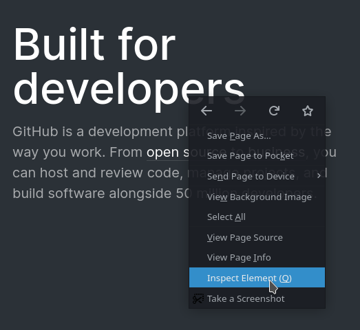

You'll be greeted with something that looks a little bit like this:

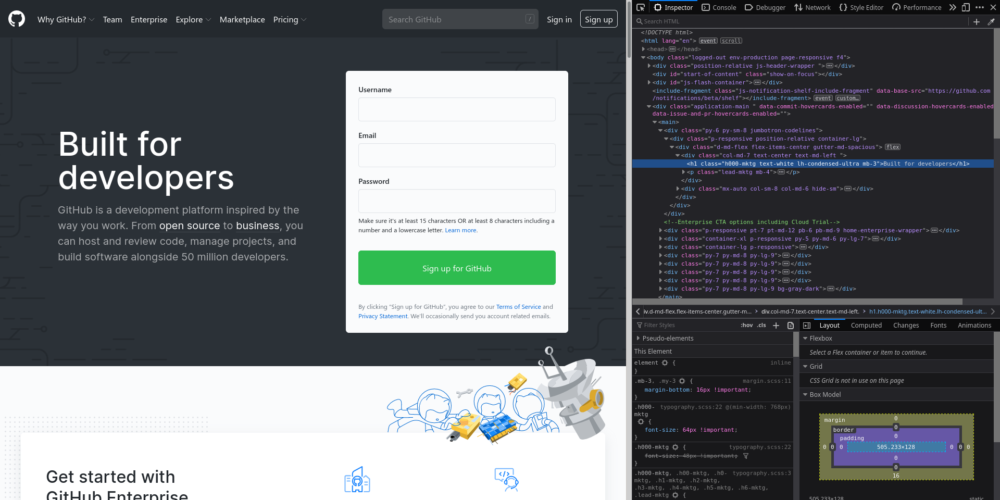

What you're looking at right now in that inspect element panel is **HyperText Markup Language (more commonly abbreviated HTML)** - one of the three languages (four if you want to count PHP) that drive the web. **It is an interpreted, declarative, tree-structured document formatting language** that is processed by your web browser.

That is, an HTML file isn't compiled, and nothing special needs to be done to it for your web browser to understand it. As for the rest of that definition, it might sound like a bunch of words right now, but by the end of this lesson, you should be able to understand (and explain) what it all means.

But first, let's start with the basics.

## What's in an `index.html`?

Files containing HTML code are called **documents**, in the same way that the file you're reading right now is a markdown **document**. HTML is intended to be an easy-to-learn, easy-to-use markup language whose contents still make some sort of sense to the untrained eye. But, like a great deal of file types, they require a small amount of unintuitive information to indicate the purpose of their contents.

In the case of HTML, this means that your file extension needs to be `.html`, and the first line in the file needs to be:

```html
<!DOCTYPE html>
```

This is just a line to tell your web browser that the contents of this document are HTML, and to process it as such. The `DOCTYPE` portion of this isn't case sensitive, but while `<!doctYpE html>` works all the same, most people stick to either all uppercase or all lowercase.

Next, we declare a few basic areas of our code.

```html
<!DOCTYPE html>
<html>
    <head>
        This is where the head is!
    </head>
    <body>
        This is where the body is!
    </body>
</html>
```

Just looking at this code might be unfamiliar or hard to follow, but the best part of frontend development is that you can always take a look at what your work looks like directly in your web browser!

With that, let's go ahead and save this file as, say, [`index.html`](./index.html), and open it in the web browser of your choice. You should see something like this:

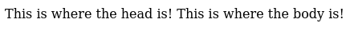

Of course, everyone's operating systems and web browsers vary, so what you see might not be exactly the same (if you changed your system's defualt fonts, for example), but you should see something at least a little bit similar.

### What's special about `index.html`?

It may have seemed like an odd choice to use the filename "index". There's a deliberate reason behind this.

When someone navigates to a directory (say, "`/cats/`") on your web server, the first file that is served by default to the web browser is `index.html` - what the web browser expects to be an index of the directory they just requested!

### Prelude to tags: comments in HTML

Now, before we move on, we should also talk about comments in HTML. If we want to leave a note to ourselves for later on, we can simply add one by surrounding its contents with `<!--` and `-->`. For example: `<!-- THIS IS MY COMMENT -->`. Be careful with comments in an HTML document though! Since this document is read directly by the web browser, anyone on the Internet with access to it will be able to read your comments as well by just downloading the source. In short, **don't put any sensitive information in an HTML comment!**

Now that we have a grip on what we wrote actually looks like in the browser, let's start analyzing what's going on here. To do that, we're going to have to begin with the most essential part of HTML: **tags**.

## Tags

HTML is, at its core, structured with the "atoms" of your webpage called **tags**, which surround plain text and/or other tags.

The start of a tag (its **opening**) is its name in angle brackets, like this: `<tagName>`. A tag is ended or **closed** in angle brackets with a forward slash at the start, like this: `</tagName>`.

For example, `<head>this is surrounded by 'head' tags!</head>`.

Or `<h1>this is a sentence surrounded by 'h1' tags!</h1>`.

So looking back at [`index.html`](./index.html):

```html
<!DOCTYPE html>
<html>
    <head>
        This is where the head is!
    </head>
    <body>
        This is where the body is!
    </body>
</html>
```

We can see the three areas are encapsulated by tags:
* html
* head
* body

### `<html>`

This is the **root** of our document. It is where all other parts of your HTML document are intended to fall under.

### `<head>`

This is where all the things that you would prefer the web browser not to render go. Though we haven't gotten there quite yet, there are particular tags in HTML that connect resources on the web that you would put here. There are also tags that provide information about your document to other resources on the web, such as search engines or indexers.

### `<body>`

This is where all the things that you would like for the web browser to render go.

### Interlude to more tags

Great! So now we understand the basics of our webpage structure, but it should go without saying that these three tags aren't the only ones we can use. Think about how boring the web would be without variety!

To start our investigation into the other tags at our disposal, recall our example using the 'h1' tag: `<h1>this is a sentence surrounded by 'h1' tags!</h1>`.

If tags are used to identify and encapsulate areas of our document, what does this 'h1' tag do?

### `<h1>`

The 'h1' tag stands for **header [of size] 1**. That is, **it makes the contained text big and bold**. There are six versions of the header tag, in descending order of magnitude. Since markdown headers follow the same conventions, we can take a look at them below:

# h1
## h2
### h3
#### h4
##### h5
###### h6

Let's also take a look at what those might look like on the page. While we're at it, let's comment out our text that we don't want rendered from the `<head>` tag to guarantee it won't be rendered.

```html
<!DOCTYPE html>
<html>
    <head>
        <!-- This is where the head is! -->
    </head>
    <body>
        <h1>This is h1</h1>
        <h2>This is h2</h2>
        <h3>This is h3</h3>
        <h4>This is h4</h4>
        <h5>This is h5</h5>
        <h6>This is h6</h6>
    </body>
</html>
```

Opening up [`index.html`](./index.html) in our web browser once more, here's what the page looks like.

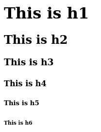

From here, let's investigate a few other tags that are essential to know.

### `<p>`

The 'p' tag is a **paragraph**. It keeps text nice and tidy. Here's what it looks like when we add `<p>This is a paragraph</p>` to our page:

```html
<!DOCTYPE html>
<html>
    <head>
        <!-- This is where the head is! -->
    </head>
    <body>
        <h1>This is h1</h1>
        <h2>This is h2</h2>
        <h3>This is h3</h3>
        <h4>This is h4</h4>
        <h5>This is h5</h5>
        <h6>This is h6</h6>

        <p>And here's our paragraph with lots of text in it.</p>
    </body>
</html>
```

Opening our file once more in a web browser, this is what we see:

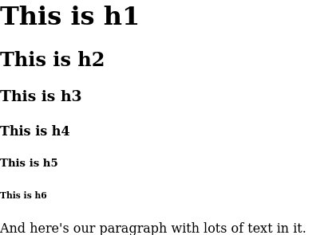

### `<span>`

A span doesn't do anything to your text aside from display it to your screen. This is because its intended use is to help markup part of another text element. That means that it is intended to be used like this: `<p>This is a <span>marked-up</span> paragraph!</p>`.

This said, you can still use it on its own.

Let's add some to [`index.html`](./index.html)!

```html
<!DOCTYPE html>
<html>
    <head>
        <!-- This is where the head is! -->
    </head>
    <body>
        <h1>This is h1</h1>
        <h2>This is h2</h2>
        <h3>This is h3</h3>
        <h4>This is h4</h4>
        <h5>This is h5</h5>
        <h6>This is h6</h6>

        <p>And here's our paragraph with lots of <span>text</span> in it.</p>

        <span>This is a span</span>
    </body>
</html>
```

Notice here that we added two spans. One of them was used standalone beneath our paragraph, and the other was used to wrap a word within our paragraph. Opening this in our browser, now we have:

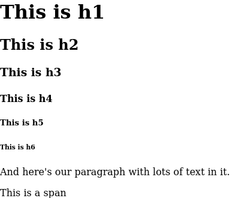

Notice that the span does not modify the word 'text' in our paragraph here in any way - it simply wraps it.

### `<ol>`, `<ul>`, and `<li>`

Moving on, we can discuss the tags that compose lists in HTML. 'ol' stands for '**ordered list**', while 'ul' stands for '**unordered list**'. In markdown, this looks like:

1. This
2. is
3. an
4. **ordered**
5. list!

* This
* is
* an
* **unordered**
* list!

We've covered two of the three tags this section is named for, which leaves 'li' - a **list item**. Inside of your list container tags, place `<li>` tags to declare the elements of the list. This way, if you want to change the display style of a list from ordered to unordered, or vice versa, all you need to do is change the container tags.

So, to create an ordered list, we would write:

```html
<ol>
    <li>This</li>
    <li>is</li>
    <li>an</li>
    <li>ordered</li>
    <li>list!</li>
</ol>
```

And to create an unordered list, we would write:

```html
<ul>
    <li>This</li>
    <li>is</li>
    <li>an</li>
    <li>unordered</li>
    <li>list!</li>
</ul>
```

Let's add these to our page and see what it looks like. Since things are getting a little bulky to keep in a single figure of code, we will trim down the excess:

```html
<!-- ... -->
        <span>This is a span</span>

        <ol>
            <li>This</li>
            <li>is</li>
            <li>an</li>
            <li>ordered</li>
            <li>list!</li>
        </ol>

        <ul>
            <li>This</li>
            <li>is</li>
            <li>an</li>
            <li>unordered</li>
            <li>list!</li>
        </ul>
    </body>
</html>
```

Opening [`index.html`](index.html) on a web browser, we can immediately see what our changes have done:

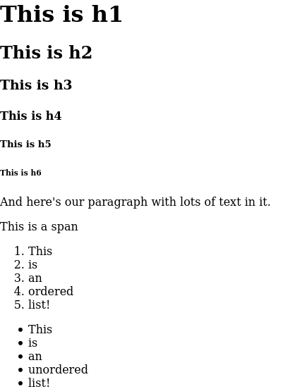

### `<div>`

The 'div' tag is used to define a **division**, or section of your webpage. It does not serve an immediate purpose for marking up a document, or modifying the page.

To use a div tag, simply wrap the part of your document you wish to be in a single section with `<div> ... </div>`.

For example, if we wanted to separate our headers and text-related tags from our list tags, we would wrap the contents in separate div tags:

```html
<!-- ... -->
    <body>
        <div>
            <h1>This is h1</h1>
            <h2>This is h2</h2>
            <h3>This is h3</h3>
            <!-- ... -->
        </div>

        <div>
            <ol>
                <!-- ... -->
            </ol>

            <ul>
                <!-- ... -->
            </ul>
        </div>
<!-- ... -->
```

The indentation is optional, but it helps make things readable. Notice how there is a clear distinction between the two **divisions** of our document now?

You can confirm for yourself that the addition of the div tags did not change anything visually to your document by opening the modified file in your web browser.

### `<a>`

What if we wanted to display a link to forward the person browsing our webpage to another website? For example, what if we wanted to forward the user to one of our social media accounts, or to our GitHub? We can do this with the 'a' tag.

The 'a' tag is a **hyperlink**. It allows you to create links from your page to others.

Why is it 'a' and not 'h', or 'hyper'? Historically, 'a' stands for **anchor**, as in, where the **anchor** [of a hyperlink] begins and ends.

We declare an 'a' tag and all its relevant information in the following format: `<a href="LINK_TO_PAGE">TEXT OF LINK!</a>`.

You may have noticed that our tag opening has some extra information in it. This is a concept in HTML called a **property**. We will discuss these in greater detail in the [properties section](#properties) of this document, but for now, just think of it as an "argument" to the tag.

In this case, the `href` property is the **Hypertext REFerence** - or link - that the anchor should navigate to. If we wanted to create a link to UCLA ACM's website, for example, we would add to our webpage the following:

```html
<!-- ... -->
                <li>list!</li>
            </ul>
        </div>

        <a href="http://www.uclaacm.com/">Visit UCLA ACM!</a>
<!-- ... -->
```

Taking a look at our webpage now:

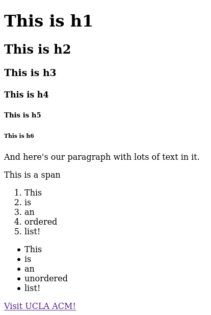

### ``

This is a tag that displays an **image**!

An image tag is declared as follows:

`</img>`

Notice the inclusion of two properties of the tag that we may specify:
* `src`: the URL or path to your image. If you want to use an image from the Internet, you can just copy and paste the link here (although be wary of usage rights). If you want to use an image from your computer, make sure it is publicly available, and use a relative link (`./my/image.png`).
* `alt`: the text that should be displayed in the event that your image can't be loaded.

Having the closing tag for an image is a bit useless, though. It wouldn't make sense to nest any components within it. The good news is that we can eliminate this closing tag in HTML thanks to **self-closing tags**.

To make a tag **self-closing**, simply add `/>` in place of your usual `>` to the opening of the tag. For example: ``.

With this in mind, let's find an image and add it to our document:

```html
<!-- ... -->
    <body>
        <div>
            <h1>This is h1</h1>
            <h2>This is h2</h2>
            <h3>This is h3</h3>
            <!-- ... -->
        </div>

        <div>
            <ol>
                <!-- ... -->
            </ol>

            <ul>
                <!-- ... -->
            </ul>
        </div>

        
<!-- ... -->
```

Notice we take advantage of the self-closing tag here. Let's open this in our web browser to see what it looks like:

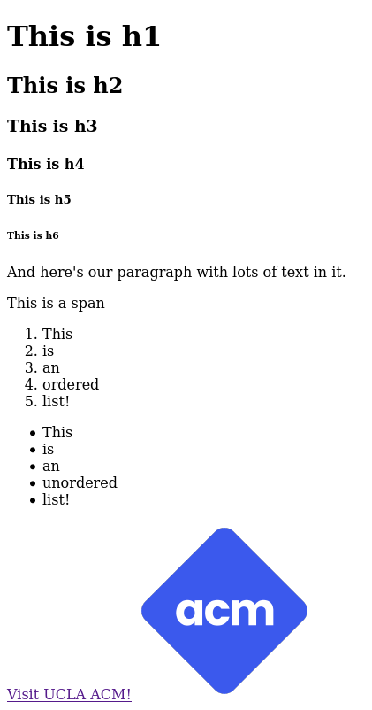

### `<link>`

The 'link' tag links your page to another resource, while defining the relationship between the two. This tag might seem useless right now, but we will make use of it soon in our [CSS section](#styling-with-css)!

This will make more sense when we start talking about CSS, but for now we can discuss its properties:
* `href`: the path to the resource
* `rel`: the relationship of this resource to our document
* `type`: the type of file the link points to

### Tags: In Summary

To summarize, we have a variety of HTML tags to declare areas of our page and the properties they may have. At the minimum, we learned:
* Headers
* Paragraphs
* Hyperlinks
* Images
* Ordered and unordered lists
* Divs
* Spans
* Links

But this is just the beginning of the tags in HTML. Although many of them don't see their fair share of use, there are a variety for you to investigate on [w3schools' list](https://www.w3schools.com/TAGS/default.ASP).

## What it means to be "tree-structured"

Recall at the [very start of this document](#what-is-html), where we mentioned that HTML documents are tree-structured. Think of the root of the document (the `<html>` tag) as the root node of a tree, and where its immediate children are child nodes. Continuing with this idea, consider each tag as a node on the tree, and its children as its descendants. For our current [`index.html`](index.html), the structure would look like:

* HTML
  * head
  * body
    * div
      * h1
      * h2
      * h3
      * h4
      * h5
      * h6
      * p
        * span
      * span
    * div
      * ol
        * li (x5)
      * ul
        * li (x5)
    * a
    * img

This concept is critical for working with the document in JavaScript, a topic that we will cover at a later time. For now, just remember that the document you're writing can be structured as a tree!

## Properties

Tags all have properties, as well. We have avoided talking about them until now, but the idea behind them is that before one writes the `>` at the end of a tag's opening, they can specify certain properties about that particular tag, or pass it certain values. Think of it kind of like the constructor list of an object in a traditional object-oriented langauge!

To specify a property of a tag, the format is `<tagName propName="propValue" anotherPropName="propValue1 propValue2>`. Notice that you can have multiple properties on a tag, as well as multiple values passed to a single property. Looking at this format, can you think of some examples we've already seen?

If you recall, we've already seen a few properties in action:
* The `src=""` in ``
* The `href=""` in `<link>` and `<a>`
* The `type=""` and `rel=""` in `<link>`

These properties are specific to those tags, though, so let's talk about the properties that all drawable tags have: **class and id**. These properties don't change anything about the appearance of the tag they are applied to immediately, but if we `<link>` the right resources to our HTML document later on, we can customize tags by targeting those that match particular properties.

### Class

We can designate a particular tag on our page as a particular class of tag with this property.

For example, if we would like to declare our h1, h2, etc. tags to all be of class 'header', we write:

```html
<h1 class="header">This is h1</h1>
<h2 class="header">This is h2</h2>
<h3 class="header">This is h3</h3>
<!-- ... -->
```

### ID

We can designate a particular tag an ID with this property. For example, if there's an important element on the page like the title of the entire thing, we would give it the ID `page-title`.

Let's make our `<h1>` header at the start of the page the page title:

```html
<h1 class="header" id="page-title">This is h1</h1>
<h2 class="header">This is h2</h2>
<h3 class="header">This is h3</h3>
<!-- ... -->
```

# Styling with CSS

At this point, there are likely a handful of questions about properties floating around. Why do we need them? What's the point of a `<link>`? What if we want to spice up our website? Add some color, change the size of things, the font maybe?

This is where the last two S's of CSS come in: "Cascading **Style Sheets**".

That's rather self-explanatory! CSS is the language used to dictate any sort of styling changes to our site we wish to make.

Why are they cascading? To answer that question, we will first have to learn how to read CSS.

## Reading, writing CSS

CSS is written fairly simply:

```css
selector {
    propertyName: value;
    otherProperty: otherValue;
}
```

The **selector** can be [one of a variety](https://www.w3schools.com/cssref/css_selectors.asp), but for our purposes, we'll discuss three properties we talked about: tag name, class, and ID.

The **property** name can be [any one of the comprehensive list](https://www.w3schools.com/cssref/).

The **value** of the property can be - in most situations - [any of those offered](https://www.w3schools.com/cssref/css_units.asp), but for our purposes, we will focus on two basic ones:
* General measurements by pixels (px)
* Colors by hex code, RGB, and HSL

### Selectors

To select a **class** of elements on the page, we prepend the class name with a dot (`.`). To select the "big" class from our page and change the styling of it, we would write:

```css
.big {
    /* ... */
}
```

To select all elements that have a **list of classes**, we list them one after another with `.`. To select all elements from our page with a class list containing both "big" and "title", we would write:

```css
.big.title {
    /* ... */
}
```

To select an element by its **ID**, we prepend the ID name with a hash (`#`). To select the "title" ID from our page, we would write:

```css
#title {
    /* ... */
}
```

If you have multiple items with the same ID, this styling will apply to both of them, but you should generally only keep a 1:1 mapping of IDs to elements of your document.

### Properties and values

Moving on, let's discuss some of the potential styling choices that one can make.

Every CSS property has a particular value and format to which it adheres. If you're ever confused about what the format of a particular property's value is, you can check online by looking it up. A good resource for this is the [Mozilla Developer Network](https://developer.mozilla.org).

#### `font-size`

We can change the font size of a particular element with this property. Since we're getting started, we will use measurements of pixels.

```css
h1 {
    font-size: 50px;
}
```

#### `font-weight`

Font weight controls how bold or how light a font is. A lower number means the font will appear more thin, while a higher number means that the font will appear more bold. The font weight that you see by default is 400. Bold is usually 600 or 700, and light is often 200 or so, but you can choose whatever you'd like that is supported by the font!

Example:

```css
h1 {
    font-weight: 200;
}
```

#### `color`

This property allows us to change the color of text contained by a particular tag. One can use any of the following color code combinations:
* Named colors: `white`, `red`, `green`, `blue`, `grey`, `black`, ...
* Hex: `#030123`
* RGB: `rgb(3, 1, 35)`
* HSL: `hsl(243, 94%, 7%)`

Example:

```css
body {
    color: #030123;
}

a {
    color: green;
}
```

#### `background-color`

With this property, we can choose the color that we would like to be the background of a tag. It uses the same color code combinations as mentioned above:

```css
body {
    background-color: rgb(3,1,35);
}
```

#### `border`

Border will be our first exposure to a shorthand property in CSS. As mentioned earlier, each property in CSS has its own specific declaration. However, a bunch of specific declarations get difficult to work with very fast.

This is where shorthand properties step in.

There are specific properties in CSS to create borders around elements (`border-left`, `border-top`, `border-right`, `border-bottom`, `border-color`, `border-style`), but this shorthand property, `border`, wraps all the information needed to create a border into a neat little declaration.

Let's check the [MDN reference for it](https://developer.mozilla.org/en-US/docs/Web/CSS/border):

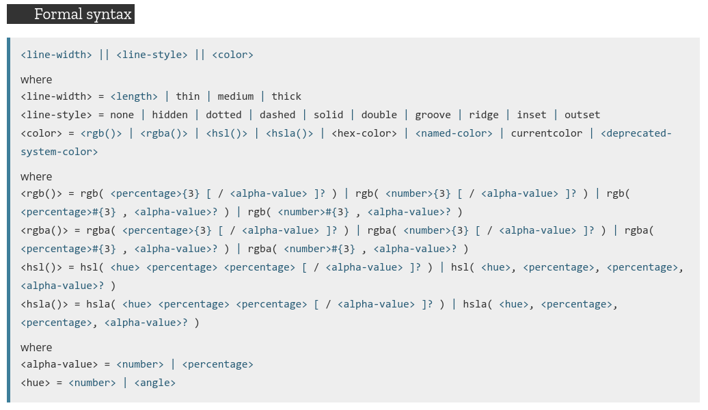

To extract the relevant portion of this, the value for the `border` property is `<line-width> || <line-style> || <color>`.

Let's write an example where we draw a thick, blue, dashed border around all classes with the `bordered` class. Let's also draw a black border around paragraphs.

```css
.bordered {
    border: thick dashed blue;
}

p {
    border: thin solid black;
}
```

#### Writing some CSS for our website

With this out of the way, let's take a look at some real CSS in the flesh. We will save this CSS in a file we call [`base.css`](base.css). Comments will be left throughout to help explain what each part does.

```css
h1 {
    font-size: 50px;
}

h1 {
    font-size: 30px;
}

/* add a border around paragraphs and change their font to comic sans */
p {
    font-family: Comic Sans MS;
    border: thin solid black;
}

/* give divs a different background color */
div {
    background-color: aliceblue;    /* this is a real named color in CSS! */
}

/* style elements with the class "reallybig" to have a font size of 100px */
.reallybig {
    font-size: 100px;
}

/* style the element with the ID page-title to have a font weight of 700 (bold) */
#page-title {
    font-weight: 700;
}
```

Now all that's left is to link this file to our document. But before that...

You may have noticed that we have multiple definitions of `font-size` for `h1` tags. Remember how we mentioned earlier that we would learn what the **cascading** part was of CSS? The answer lay in this example - the way that CSS determines the priority of styles.

## \*\*Cascading\*\* Style Sheets

When there are multiple rules applying to the same element, [CSS' cascade and specificity rules come into play](https://developer.mozilla.org/en-US/docs/Web/CSS/Specificity).

At a high level, the last rule to be declared is what takes precedence. So in our example above, the last `h1` styling rule takes precedence, making our font size 30px.

However, when there are multiple rules applying from multiple **selectors**, precedence takes effect. **The most specific selector wins out on conflicting rules**.

Here's the list of selector specificity, in order of least to most specific:
* Type selectors (`h1`, `div`, etc.)
* Class selectors (`.reallybig`)
* ID selectors (`#page-title`)

So if we wrote, using our stylesheet above:

```html
<h1 class='reallybig' id='page-title'>Conflict?</h1>
```

We would see that the font size from the class selector (`.reallybig`) would win out, and the ID styles would still be respected (since there was no conflict).

Before we move on, there are of course ways to override these rules, but you should only do so sparingly. By appending `!important` to the end of a value for a particular rule, we can guarantee that the rule will win out in cases of conflict. However, this should be reserved for incredibly specific situations, such as for overwriting rules from a CSS framework - but even then you can take advantage of the cascade!

## Linking CSS files to our webpage

Now that we've learned how to read and write CSS, how will we link this in to our webpage to apply the styling changes? Easy enough, we use the [`<link>`](#link) tag!

Running down the list of properties for a `<link>`:
* Our file's path (`href`) is `./base.css`.
* Our file's type (`type`) is `text/css`.
* Our file's relationship to the document (`rel`) is a `stylesheet`.

Putting this information all together: `<link href="./base.css" type="text/css" rel="stylesheet" />`

Since this is something that we would like to be loaded prior to the content of our document, we will place the link in the `<head>` of the document:

```html
<!DOCTYPE html>
<html>
    <head>
        <!-- This is where the head is! -->
        <link href="./base.css" type="text/css" rel="stylesheet" />
    </head>
    <body>
<!-- ... -->
```

While we're here, let's also give some elements the class and another the ID we made:

```html
<!-- ... -->
        <div>
            <h1 class='reallybig' id='page-title'>This is h1</h1>
            <h2>This is h2</h2>
<!-- ... -->
```

With this, we can see the styling changes immediately reflected:

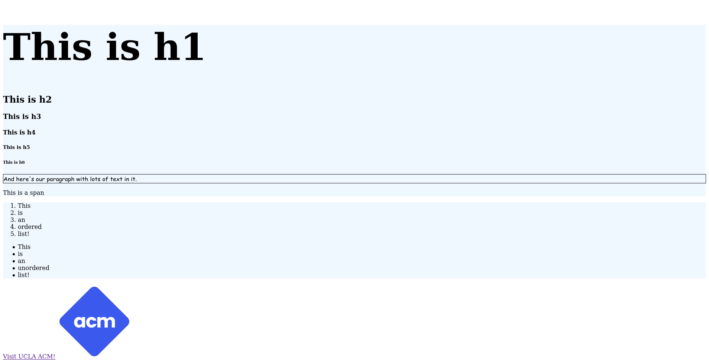

Wow. That's...

...certainly something.

Luckily, we don't need to live with these strange styling decisions! We can always change them now by editing [base.css](base.css).

## Basic CSS: Summary

To sum it all up, we learned about what **CSS** means, how to read and write it, a few basic properties and the values they expect, how its priority system works, and how to link it into our webpage!

# Project One: Building a Portfolio

The best part of frontend development is that much of what you learn is immediately applicable! So what can you do with your knowledge of HTML and CSS? Build a portfolio website for yourself!

Try building off of the sample code we have been developing throughout this document or writing your own from scratch.

Check out the [full assignment doc here](../task-1-portfolio/README.md).

***

# Reference

Much of this document relies on [w3schools](https://www.w3schools.com/) for reference.

Below are some links for you to use as reference for the material we covered today:
* [A list of all HTML tags](https://www.w3schools.com/TAGS/default.ASP)

If you'd like to learn even more material and dive even deeper in, here's some links for further reading:
* [A list of all CSS selectors](https://www.w3schools.com/cssref/css_selectors.asp)
* [A comprehensive list of all CSS properties](https://www.w3schools.com/cssref/)