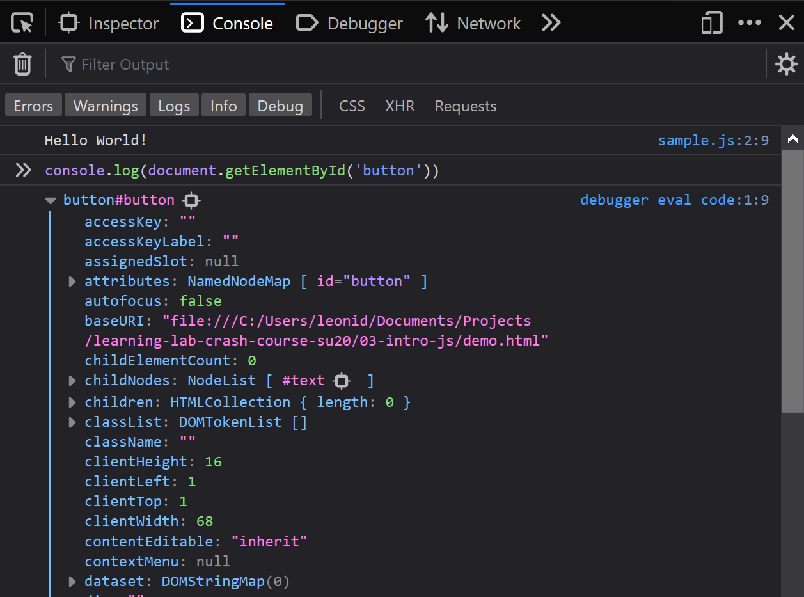

# Intro to JS: Programming Fundamentals

## Overview

This lecture (and set of notes) is supposed to be a primer into Javascript for developers with experience in another imperative language (e.g. C++, Java, Python, etc.). At UCLA, CS (and related) majors typically start with C++, so we'll draw some comparisons with it there - however, we don't make any assumptions of what your previous language is.

Here's what we plan to cover in this workshop:

* Types in Javascript
* Variables & Scope
* Some Basic Data Structures (List, Object, ...)
* Functions (and functional programming!)
* Loops and Conditional Flow
* Interacting with the DOM

By the end of this lesson, you'll know enough Javascript to make simple interactions on a website, and more importantly, have a strong-enough of a foundation to start exploring it on your own, if you'd like.

Let's get started!

## Table of Contents

## What is Javascript?

In a one-liner, Javascript is a programming language that we use to add interactivity to websites. Interactivity is a very broad term here: it could involve clicking a button to show some text, get data from an external source, or involve rendering a video game on a website!

Today, we'll talk about the core application of Javascript (in the browser, manipulating the DOM); later, we'll discuss things like React and Node and how they're relevant.

But first, we need to get a solid understanding of the language itself.

What do our friends at the MDN say?

> Javascript is a lightweight, interpreted, or just-in-time compiled language with first-class functions.
>
> ...
>
> [It] is a prototype-based, multi-paradigm, single-threaded, dynamic language, supporting object-oriented, imperative, and declarative (e.g. functional programming) styles.
>
> ([*mozilla developer network*](https://developer.mozilla.org/en-US/docs/Web/JavaScript))

Wow, that is a lot of words. **A lot.** Today, we'll unpack some of them, and understand how they'd affect us in day-to-day Javascript programming.

In particular, we'll try to emphasize where Javascript is like other programming languages, or different from other languages; in general, we feel that this is a good approach to take when learning languages.

## Hello World

First, how can we even run Javascript? For now, we're going to restrict ourselves to our browser.

Let's open up an HTML file:

```html
<!DOCTYPE html>
<html>
    <head>
        <title>we're going to learn JS!</title>
    </head>
    <body>
        <p>I'm so excited to learn Javascript!</p>
    </body>
</html>
```

We can add Javascript by using the `<script>` tag:

```html
<!DOCTYPE html>
<html>
    <head>
        <title>we're going to learn JS!</title>
    </head>
    <body>
        <p>I'm so excited to learn Javascript!</p>
        <script>
            // some Javascript can go here!!
        </script>
    </body>
</html>
```

Cool! We haven't rendered anything to the page yet, but we have learned our first piece of Javascript: you can use `//` to comment (and as you might expect, `/* */` to block comment).

This is pretty inconvenient though, because we're going to have all of our HTML and JS in this one mega-file. Let's modularize a bit:

```html
<!-- sample.html -->
<!DOCTYPE html>
<html>
    <head>
        <title>we're going to learn JS!</title>
    </head>
    <body>
        <p>I'm so excited to learn Javascript!</p>
        <script src="sample.js"></script>
    </body>
</html>
```

Now, let's make our `sample.js` file, and do our customary hello world.

```js
// sample.js
console.log("Hello World!");
```

If you go to your page, it'll look  like nothing has happened. But, we need to look a little closer. Go to your browser's console (usually from the Dev Tools, or "Inspect Element"):


Would you look at that! We did it!

But first, exactly *what* did we do? Let's break down our code a little bit, and learn some more about JS.

```js
// sample.js
console.log("Hello World!");
```

There are actually quite a few details we can learn about the language:

* `"Hello World!"` is a string, so Javascript supports strings!
* `console.log()` looks like a function, and the `.` implies some sort of object-based properties
* there are semicolons! (it turns out, these are optional. maybe more on that in a bit)
* Javascript seems imperative and sequential! if you don't know what that means, no worries.

If you've programmed in languages like C++, Java, or Python, this will all sound familiar to you. And that's great! Many of the basic syntax rules that Javascript has are very C-like.

One other thing: you'll note that we didn't have to do any compiling. That's because Javascript is *interpreted*. More on that later.

## Variables and Types in Javascript

First, how do variables work in Javascript? It turns out, that's a more complicated question than you might think. Here's a basic hello world, with variables:

```js
// sample.js
let helloStr = "Hello World!";
console.log(helloStr);
```

That wasn't too hard! `let` is the default variable keyword that we're going to use. This is inspired from Lisp, if you were wondering.

But hold on. We didn't say anything about the type of helloStr. If your background is in statically-typed languages, this should ring an alarm. How does the interpreter know what type `helloStr` is?

The answer is that Javascript is **dynamically typed**. In other words, the type of a variable, an expression, or the return value of a function, all of these things are **evaluated at runtime**. If your interpreted background is Python, this is the same behaviour you'd expect; if your favourite interpreted language is OCaml, you're probably pretty sad.

However, a language being dynamically typed is not the same thing as saying that it has no types. Javascript still has types, and in fact, a good understanding of these types is very important!

### Primitive Types

Javascript has 7 "primitive" types, which technically means that they are **immutable**.

The primitive types are:

* `Boolean` (`true` or `false`)
* `Number` (spec'd as a 64-bit float)
* `String` (uncommon to languages)
* `BigInt` (arbitrary-precision number)
* `Undefined` (special)
* `Null` (special)
* `Symbol` (new, and out-of-scope of this lecture)

Here are some examples:

```js
console.log(true);
console.log(false);
console.log(42);
console.log("owo");
console.log(12342942374982342342342323423423423234234234234234223423423423423423423423423423);
console.log(undefined);
console.log(null);
// Symbol is out of scope :(
```

Some of these are familar: almost every language has `Boolean` (except C, I'm looking at you). It's convenient that Javascript supports strings out of the box (C, I'm looking at you again).

There are some noticeable missing entries. Javascript doesn't have C-like `int`, `short`, `double`, or other types of integer/float precision: it's just floating point. This leads to some fun shenanigans:

```js
console.log(0.1 + 0.2);
// 0.30000000000000004
console.log(0.1 + 0.2 == 0.3);
// false
```

(implicitly, we've also learned here that `+` works with numbers in the way you might expect, and you can use `==` to perform an equality check)

Javascript also doesn't have `char` or some equivalent (but that's not a huge deal, string-everything is ok). And finally, we'll notice that Javascript doesn't have an explicit pointer type - even though *references are a big deal*, and an understanding of references is important.

### Type Coercion

This is a good time to bring up type equality and coercion. **Type coercion** is the automatic conversion of types in certain operations. We'll spend some more time on this in a bit, but let us introduce what we mean:

```js
console.log(42 == "42");
// true
console.log(42 === "42");
// false

console.log("42" - 1);
// 41
console.log("42" + 1);
// "421"
```

Wow, that set of statements seems needlessly confusing.

* `==` is a **coercive** or **loose** equality. It tries to convert both items to the same type first.
* `===` is strict equality. It doesn't perform any coercion, and only is true if both sides are the same type and value.
* `-` only works with `Number` and `Number` on both sides; so, it'll convert everything to `Number` first.
* `+` is a little trickier! If the types aren't the same, it prefers string concatenation (weird, right), so it'll first try converting everything to a string. That *always works*, so we never explore the path where it's a number!

This brings the interesting question: what happens in this snippet?

```js
console.log(1 - "wow!");
// NaN
```

Like many other float conventions, Javascript has NaN - or **Not a Number**. This is a special value that you'll get if the computation doesn't make sense (e.g. a number minus a string). `NaN` propagates as well: `NaN` times anything is `NaN`, `NaN` subtracted by anything is `NaN`, etc.

Coercion also happens with booleans: values that are `0`, `null`,`undefined`, `""` (the empty string) and `NaN` are coerced to `false`, and the rest are `true`. Note that this coercion doesn't occur with `==`, since it doesn't require a boolean; we're more talking about conditionals (which we'll see soon)!

### Everything is an Object

It turns out, everything in Javascript is an *object* - and we mean object in an *object-oriented* programming way.

Let's take arrays, for example. Like many other programming languages, Javascript supports variable-length arrays (which are really more like lists).

```js
let arr = [1,2, "cat", "dog"];
// yup, JS lets you have elements with different

console.log(arr[2]);
// "cat"

console.log(arr.length);
// 4

arr.push("🥺");
// 🥺 - that's right, you can put emojis into arrays
// oh... the important thing being that arrays are mutable (unlike primitve types!)

console.log(arr);
// [1,2,"cat","dog","🥺"]
```

And, there are more options for things like slicing an array, popping from the front/back, etc. A few things to note:

* JS arrays/lists allow for hetergenous types!
* They are a linked list, stack, and queue all conveniently packaged into one data structure!
* You can initialize an empty array too, like so: `let arr = [];`
* **an array is an object**

That's right, this array was an object. Under the hood, when we called `let arr`, we "called the constructor for an array" (not... entirely true). Then, when we do things like `.length` or `.push()`, we're accessing variables or using class functions respectively!

This is the case for *every data type* in Javascript, including the primitve ones we discussed earlier! They all stem from one "class" (not entirely true) called `Object`, which has a [wide variety of predefined properties and methods](https://developer.mozilla.org/en-US/docs/Web/JavaScript/Reference/Global_Objects/Object). You'll probably find the `toString()` method helpful later on. This is very similar to how Java works.

Exactly how do objects work in Javascript? Well, they're **key-value** pairs. In fact, that makes the `Object` class itself very useful: it's a dictionary! If you've heard of JSON (JavaScript Object Notation), this next syntax is going to be quite familiar:

```js
let dict = {
    key1: "hey there!",
    key2: "i'm an object!"
};

console.log(dict);
// Object {
//     key1: "hey there!",
//     key2: "i'm an object!"
// };

console.log(dict.key1);
// "hey there!"

dict["owo"] = "uwu";
console.log(dict.owo);
// "uwu"
```

Hopefully, this should look somewhat familar to arrays, because arrays **are just a type of object**!

There is one important note about objects in Javascript. The variable that "holds" an object is really just a reference to an object. This leads to an issue with "deep copying" or when you have a nested object.

```js
let a = {
    b: { c : 5 }
};
let newCopy = a;

newCopy.b.c = 3;

console.log(a.b.c);
// 5
```

Oh no! Unfortunately, this means that to truly "copy" an object, you can't just make another variable and give it the same value. This is the exact same concept that exists in C++, Java, etc. with objects and deep copying.

So, is there a solution? Kind of? Many different JS libraries implement their own version of deep copying, and since ES6 (a version of Javascript), fancy functions like `Object.assign()` and the shorthand [spread syntax](https://developer.mozilla.org/en-US/docs/Web/JavaScript/Reference/Operators/Spread_syntax) can be used. We're not going to go into the details, but it's useful!

One last thing you might ask: do you have to `delete` objects that you're done with? No! Javascript is a *garbage collected* language, so the interpreter handles freeing memory once an object is deallocated. It also handles memory allocation, so `malloc` won't be haunting you anytime soon!

### let, var, and const

So far, we've discussed using the `let` keyword to define variables. `let` is block-scoped:

```js
if (error){
    let errorMessage = "oh no!";
}
console.log(error);
// undefined
```

It only maintains its scope in the "block" that it was defined in, which is roughly the nearest set of braces. This is similar to how variable declarations work in almost any other language that you know.

There is another keyword, `var` - in fact, this is the original one. `var` is function scoped. We... haven't gone into functions yet, but the key difference is visible here:

```js
if (error){
    let errorMessage = "oh no!";
}
console.log(error);
// "oh no!"
```

This rarely will affect you in your day-to-day coding life, but it's probably best practice to use `let` - it's the behaviour that most programmers expect. We'll go over `var` once we get to functions!

And finally, `const`? Well, it mostly behaves how you'd think:

```js
const DO_NOT_CHANGE_THIS = 42;
DO_NOT_CHANGE_THIS = 21;
// Uncaught TypeError: Assignment to constant variable.

const CONSTANT_OBJECT = {};
CONSTANT_OBJECT["a"] = 42;
console.log(CONSTANT_OBJECT);
// {a : 42}

CONSTANT_OBJECT = {};
// Uncaught TypeError: Assignment to constant variable.
```

Okay, well that first example makes sense. But what's up with the second one? Well, recall that all data types in javascript are objects, and therefore all variables are references.

So, what `const` really guarantees is that the reference will always stay the same. With primitive data types, that's great: because they're immutable, once the value is created, it'll never change. But, for every non-primitive data type, the object *is mutable*, and so it can change at any point without changing the underlying reference. Long story short? Using `const` on an object, or an array, or many other data types doesn't guarantee that it's truly constant - it just can't be reassigned.

## Quick Control Flow Stuffs

If you've programmed in a C-like language, control flow in Javascript is nothing new.

```js
let theAnswer = 42;
if (theAnswer === 42){
    console.log("The answer to the everything is 42!");
}
else if (theAnswer == 42){
    console.log("LOL you don't know how types work in Javascript");
}
else{
    console.log("So long, thanks for all the fish!");
}
// "The answer to the everything is 42!"

for (let i = 0; i < 5; i++){
    console.log(i);
}
// 1
// 2
// 3
// 4
// 5

let hungry = true;
while (hungry){
    goToBplate();
}

let committee = "...";
switch (committee){
    case "AI":
        console.log("The coolest!");
        break;
    case "Teach LA":
        console.log("Also pretty cool!");
        break;
    default:
        console.log("Eh, who cares!?");
}
```

We'll also mention that Javascript has convenient iteration/enumeration keywords, `of` and `in`:

```js
let emojis = ['🥺', '✨', '😍'];

for (let element of emojis) {
  console.log(element);
}
// 🥺 ✨ 😍

let object = { a: 1, b: 2, c: 3 };

for (let property in object) {
  console.log(property);
}
// a b c

for (let property in object) {
  console.log(object[property]);
}
// 1 2 3
```

Typically, you'll use `of` with things that are "iterable" (i.e. there is a set order to them, like an array), and `in` with things that are "enumerable" (i.e. you can name all of the things, like an object).

## Speaking of Functions...

Javascript is a **functional programming language**. By the sound of that, functions are probably pretty important. They look pretty C-like to us:

```js
function saySomething(message){
    console.log(message);
}

saySomething("hey there!");
// "hey there!"

function squared(n){
    return n^2;
}

squared(2);
// 4
```

You start by writing the keyword `function`, then the name of the function, and inside the parentheses, each parameter. Finally, you've got the body, and either an explicit `return` statement, or an implicit empty return (`return;`).

Note that there are no explicit types here! This can actually make things quite confusing.

```js
function adder(a,b){
    return a + b;
}

adder(42, 42);
// 84
adder(42, "42");
// "4242"
```

Type coercion is back again! In this case, you'd probably want to use explicit type conversions.

```js
function numberAdder(a,b){
    return Number(a) + Number(b);
}
```

This type of typecasting is essentially calling the `Number` constructor with our parameters. While this looks pretty annoying, you often have to write code like this when interfacing with other libraries, as guaranteeing types is tricky!

### First-Class Functions

Let's move on to the cool stuff though. One of the big features of functional programming languages is the idea of *first-class functions*: functions are treated like any other data type. In this case, that means that... functions are objects too!

```js
function saySomething(message){
    console.log(message);
}

let greeter = saySomething;
greeter("hey!");
// "hey!"

console.log(greeter);
// f: greeter(message) ...
```

Wow! That's not something you'll see often. The lack of type annotations makes this a little tricky ot understand, but we're basically pointing `greeter` to the "function body" of `saySomething`! Every time you use the name of the function *without parentheses or its parameters*, it's the reference to the function - just like any other variable!

One useful application of this is a *higher-order function*, or passing in functions as arguments for other functions.

```js
function friendlyGreeting(name){
    return "Hey there! Great to meet you, " + name;
}

function greetEverybody(listOfPeople, greetingFunction){
    for (let person of listOfPeople){
        console.log(greetingFunction(person));
    }
}

let flirters = ['🥺', '😘', '😍'];

greetEverybody(flirters, friendlyGreeting);
// "Hey there! Great to meet you, 🥺"
// "Hey there! Great to meet you, 😘"
// "Hey there! Great to meet you, 😍"
```

That's a trivial example, but it demonstrates the point. One more realistic example of this is the `.map` function on arrays:

```js
function double(x){
    return 2 * x;
}
let nums = [1, 2, 3, 5, 7, 11];
nums.map(double);
// 2, 4, 6, 10, 14, 22
```

This is a huge part of functional programming (something about no side effects, parallelization, etc. - out of scope of this discussion, but hit up Matt for more)! You'll find this often in React apps when you need to generate lists of components from data.

### Anonymous Functions

There's one other thing we'll quickly point out: anomyous (or lambda, or whatever you want to call them) functions.

Let's say we wanted to double all elements of the `nums` array again, but we only need to *really* do this operation once. It wouldn't make sense to write a whole function, so we'd like for a slightly more disposable medium.

Luckily, JavaScript provides for this in the form of **anonymous functions**, otherwise known as **lambda expressions** in languages like C++ and Python. It is easier to take a peek at one in action:

```py
# in python, lambda functions are very common.
# you've likely seen or used one in a call to `filter`:
nums = [1, 2, 3, 5, 7, 11]
filter(lambda item: item == 5, nums)
# [5]
```

We have an indication that we are providing a lambda expression (`lambda` in Python), the name(s) of the argument(s) it will take (`item` after the `lambda`), and the expression itself (after the `:`). In this case, we wrote a lambda expression that will return true if `item` is equal to 5. Using this expression in a call to `filter` (which takes a function argument), we filter out all the items except for 5!

With that under our belt, let's take a look at what one looks like in JavaScript:

```js
let nums = [1, 2, 3, 5, 7, 11];
nums.map(function (element) {
            return element * 2;
        });
// [2, 4, 6, 10, 14, 22]
```

Let's break down the syntax a little. Just like Python, we have:
* Indication of the start of a `function` with the keyword
* The parameter list or arguments to the function (the part in `()`)
* The body of the function (in our case, the part in `{}`)

Thus, each element in `nums` has our anonymous function called on it, and the element is set to its return value.

There are slightly cleaner ways of creating lambdas in JavaScript, but this form will never fail you. Just make sure that your lambda expression takes the parameters its caller expects, and the return value is expected as well!

## Manipulating the DOM

Okay, but how does this help us make websites? Well, the original focus was to change the "Document Object Model", which as you may recall, is a fancy word for our webpage. Let's run through a barebones example:

```html
<button id="button">
    click me!
</button>
<p>
    you've clicked the button <span id="clicks">0</span> times
</p>
```

```js
document.getElementById("button").addEventListener("click", function(){
    let clickElement = document.getElementById("clicks");
    let currentClicks = Number(clickElement.innerHTML);
    clickElement.innerHTML = currentClicks + 1;
})
```

Let's open this up in our web browser and take a peek at what's going on.


Let's focus in a little bit on this: `document.getElementById(...) ...`. If you're looking for a direct example of the DOM in JS, here it is: the literal `document` object! This is the native JavaScript representation of the current webpage.

Next, we call `getElementById()` on it, with argument `"button"`. This should be pretty self explanatory as to what it does, but let's take a look at what it actually looks like in our console:



This is the crux of the DOM. Every tag in our document is representable as an object in native JavaScript (notice the properties `classList` or `attributes`?). We call each of these tags a **node** on our page. Why a node?

Going back to the tree structure of HTML documents we discussed in lesson 1, we can see where this is useful in JavaScript. Every tag is a **node** on our webpage, with a parent node and children nodes - notice the inclusion of the `children` field.

Each node also has a variety of member functions that can be called. In our example, we call `addEventListener`.

### `addEventListener`

This is an absolutely essential function to working with the DOM. If we want a particular function to be called each time an event occurs on the webpage with respect to a certain portion of said document, we can do so with this function.

To put the function in more definite types, its signature is a little something like: `addEventListener(string eventName, function callBack)`.

That is, we specify the event to listen for (in our case `"click"`), and the function to call when said event happens.

With that out of the way, let's talk about our callback function:

```js
function(){
    let clickElement = document.getElementById("clicks");
    let currentClicks = Number(clickElement.innerHTML);
    clickElement.innerHTML = currentClicks + 1;
})
```

We declare a variable to be the element on our page with ID "clicks", cast the contents of its HTML (the `.innerHTML` field) to a `Number`, then set its `.innerHTML` field to said number + 1. That is, it increments the numerical value of the innerHTML of `clicks`.

## Some Other Quirks

optional semicolons?

interpreted? JIT?

## Additional Resources

In addition to the sources we've cited along the way throughout this document, there are a variety of parts of JavaScript and the DOM that we haven't talked about. These resources will help you to understand these other features and common use cases.

...