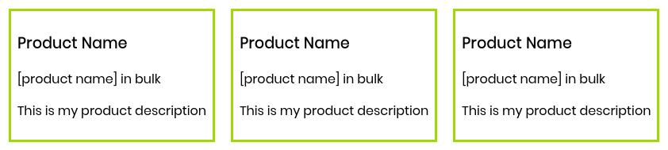
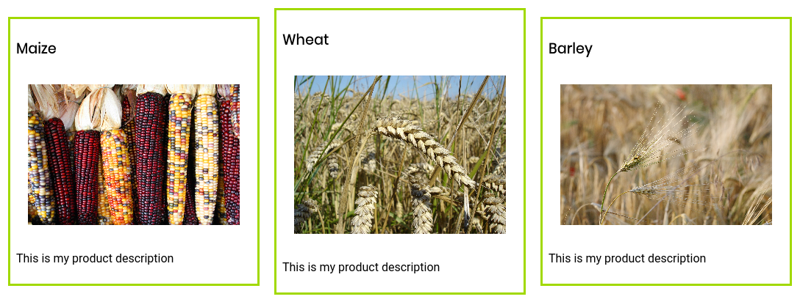
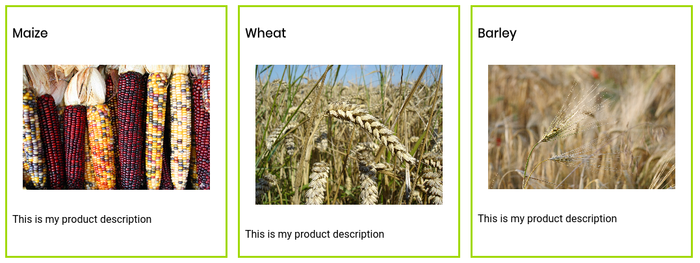
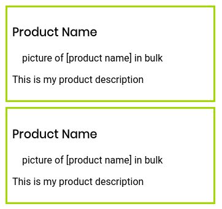
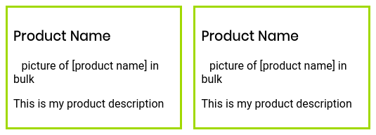
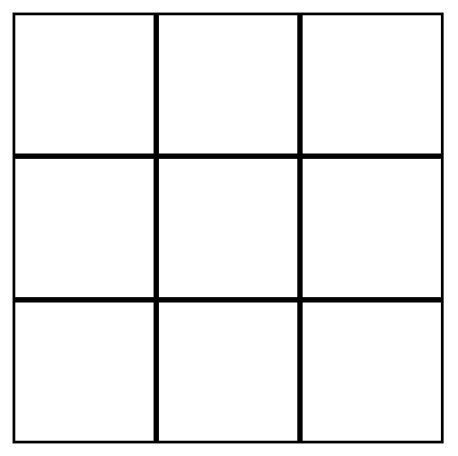

# Intermediate CSS: Flexbox & Grid

## Overview

In this session, we will learn about two of the most powerful tools in our vanilla CSS toolbox: CSS flexbox and CSS grid. These sibling layouts are perfect for making your website flexible to viewports of all sorts of varied sizes. Here's what we'll chat about today:
* What flex axis v. counteraxis
* Flex align v. justify [content, items]
* Flex grow v. flex shrink
* Flex flow
* CSS grid

By the end of this, you should be able to understand the flex axis and flow of a page. You should understand the differences between aligning versus justifying items and content in a flex container, and how CSS grid works. With this, you should be able to create a navbar for your portfolio.

## Flexbox

### Creating rows and columns; understanding the problem

Let's say I'm a farmer looking to build a neat little website to sell my crops online from. Let's first build our example "product card". For brevity's sake, we'll keep it in pure HTML with a little inline CSS:

```html
<!-- <ProductCard /> -->
<div class='product'>
    <h3>Product Name</h3>
    
    <p>This is my product description</p>
</div>
```

Again, for the sake of brevity, let's call this component `<ProductCard />`. It looks like a fancy new tag name, but in reality it will just serve as a placeholder for where we copy and paste the HTML. Now, we have two ways to lay out our three product cards for corn, wheat, and barley: tables and flexbox.

Let's try table rows first:

```html
<table>
    <tbody>
        <tr>
            <td>
                <ProductCard />
            </td>
            <td>
                <ProductCard />
            </td>
            <td>
                <ProductCard />
            </td>
        </tr>
    </tbody>
</table>
```

Let's look at this on a webpage:



Doesn't look too bad! Let's throw in our content:



This is where the table layout starts to lose traction. Our cards aren't the same height, and hence not a proper *row*. That's not all, though. Here's a few things to consider:
* Our HTML document is now incredibly difficult to read.
  * This isn't just difficult to read as a dev - think about how screen readers are going to handle reading a **table** - intended to organize data - when we use them for layout purposes. **This leads to poor accessibility**.
* Did you notice our spacing was a little bit more than we bargained for?
  * The default style rules for table elements added on some padding to the interior of the table data elements.
  * We are going to have to write more custom CSS to handle this.
* What if we want certain cards to be bigger than others? For example, what if there's more text on our special promo product card?
* What if the user's device viewport changes? For example, what if a user rotates their tablet?
* What if we need to reorder of our products without changing our source document?

This is where flexbox comes in. Instead of the wealth of tags to create a row of content inside our table, what if I told you we can use just one for the same, if not better effect?

```html
<div style='display: flex;'>
    <ProductCard />
    <ProductCard />
    <ProductCard />
</div>
```

Let's take a peek back at the webpage:



**This** is why flexbox is so great. One can easily create rows and columns of content that adjust their dimensions to preserve the row. Further, they can change the way the row or column is organized, spaced, or how its elements are sized all on the fly by changing the value of one or two properties.

As a matter of fact, `<table>`s aren't supposed to be used for layout purposes in HTML5 **at all**, and create a [wealth of problems for accessibility](https://webaim.org/techniques/tables/) that need to be addressed. Instead, we can use flexbox to accomplish our layout goals with less rules, a flatter hierarchy, and more accessible tags with less lines of code.

### Setting up flexbox

To create a flexbox container, we need to identify our **container** and our **children**. In the case of our farmer page, we have created a parent container in the form of a `<div>`. It's children are also `<div>`s:

```html
<div class='container'>
    <ProductCard class='child' />
    <ProductCard class='child' />
    <ProductCard class='child' />
</div>
```

Then, to invoke the flexbox layout on this container and its children, simply specify the property `display: flex;` somewhere in the parent's CSS:

```css
.container {
    display: flex;
}
```

All of its child elements will automatically be considered as flex items.

If we take a page where our cards are organized in the box layout with `display: block;`, the cards will be "stacked" on one another by default:



But, if we apply `display: flex;`, the visual flow *immediately* changes.



### Critical concepts in flexbox

There's a handful of concepts that are critical to understanding flexbox layouts. Let's take a look at them all:

* flex-start
* flex-end
* center
* space-between
* space-around
* stretch
* space-evenly (nonstandard definition)

These regions are all illustrated beautifully in this diagram from the [official specification from W3C](https://www.w3.org/TR/css-flexbox-1/). All diagrams used under this header are from W3C unless otherwise specified.


...

#### Flex axes and flow

In flexbox, there are two axes along which elements of the container are aligned:
1. Main Axis (set by flex-direction, either horizontal `row` or vertical `column`)
2. Cross Axis (automatically set perpendicular to the main axis)

These two axes are set by the parent properties `flex-direction` and `flex-basis`, or by the single shorthand property `flex-flow`!
* If we want our main axis to be horizontal, we set `flex-direction: row;`. This is the default.
* If we want our main axis to be vertical, we set `flex-direction: column;`.

Then, to determine whether elements should wrap around to another line when they can no longer fit, we use `flex-basis: wrap;`. Otherwise, we can use `flex-basis: nowrap;`.

#### Align v. justify in action

We can instruct a flexbox container to align its content with respect to the axes and about the aforementioned regions.

When we `align-*`, we are doing so along the **cross axis**. When we are `justify-*`ing our items, we are doing so along the **main axis**.

Here's what the same three items look like when using all possible values for `justify-content`:


Meanwhile, here are four items adjusted with all possible values of `align-items`:


#### Grow v. shrink in action

...

#### Order in action

We can also provide an ordering for each particular element in the child CSS. **Note, however, this will not change the order of your source code**.

## CSS Grid

Flexbox has a sister `display` style called grid! This one works exactly how you might expect it.

Let's visualize this with a simple webpage. I have product cards that I want to lay out in a rigid, 3x3 grid containing previews of my top items.



We will have *at most* 9 items to preview on this grid, so it works out nicely.

To create a CSS grid, we just need a container and its children.

```html
<div id='container'>
    <div class='element'>
        Content
    </div>
    <div class='element'>
        Content
    </div>
    <div class='element'>
        Content
    </div>
    <!-- ... -->
</div>
```

Then, if we want to let all our child elements occupy the specified space, the styling can be carried out entirely through the parent:
* To create columns, we use the property `grid-template-columns`
* To create rows, we use the property `grid-template-rows`
* We can specify the gaps between parts of the grid with `grid-column-gap` and `grid-row-gap`

Since we want to create a 3x3 grid, our CSS will look like:

```css
#container {
    display: grid;
    grid-template-columns: 33% 33% 33%;
    grid-template-rows: 33% 33% 33%;
}
```

That's not super clean, though. Luckily, CSS accounts for this by giving us the `auto` value. If we want to create 3 columns and rows of equal size, we can just swap out our 33% with it!

```css
#container {
    display: grid;
    grid-template-columns: auto auto auto;
    grid-template-rows: auto auto auto;
}
```

And if we wanted to go ahead and make the middle column a little larger than the others, or a specific size, we can remove that particular `auto` in favor of a specific value:

```css
#container {
    display: grid;
    grid-template-columns: auto 500px auto;
    grid-template-rows: auto auto auto;
}
```

...

***

## Resources

There's no way that we can cover all of the things you can do with flexbox in a single document or lesson, so here is a small collection of resources for you to look into regarding all of the possible properties and use cases of flexbox and grid:
* [css-tricks' guide to flexbox](https://css-tricks.com/snippets/css/a-guide-to-flexbox/): one of the most comprehensive guides to every single part of flexbox on the internet. Great for quick reference!
* [Mozilla Developer Network's guide to flexbox](https://developer.mozilla.org/en-US/docs/Web/CSS/CSS_Flexible_Box_Layout) provides a great overview of flexbox as a whole.
* The [CSS Flexbox Layout Module Level 1](https://www.w3.org/TR/css-flexbox-1/) specification. This truly is the bible of flexbox, and is surprisingly easy to read thanks in large part to the wealth of diagrams throughout - which were made extensive use of in this README.