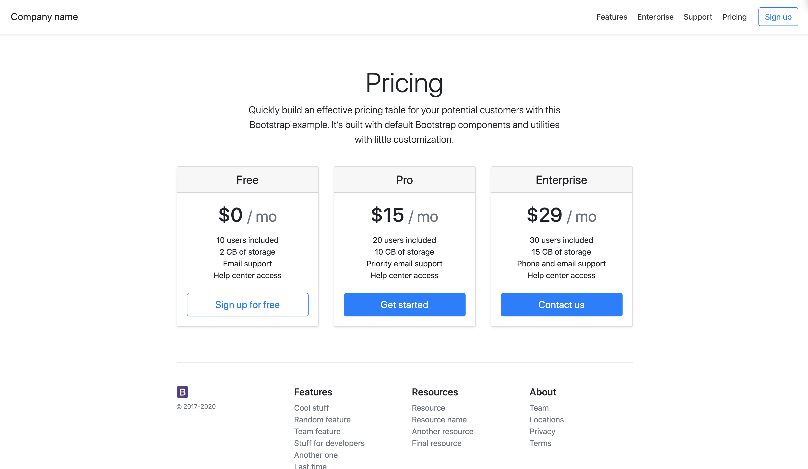
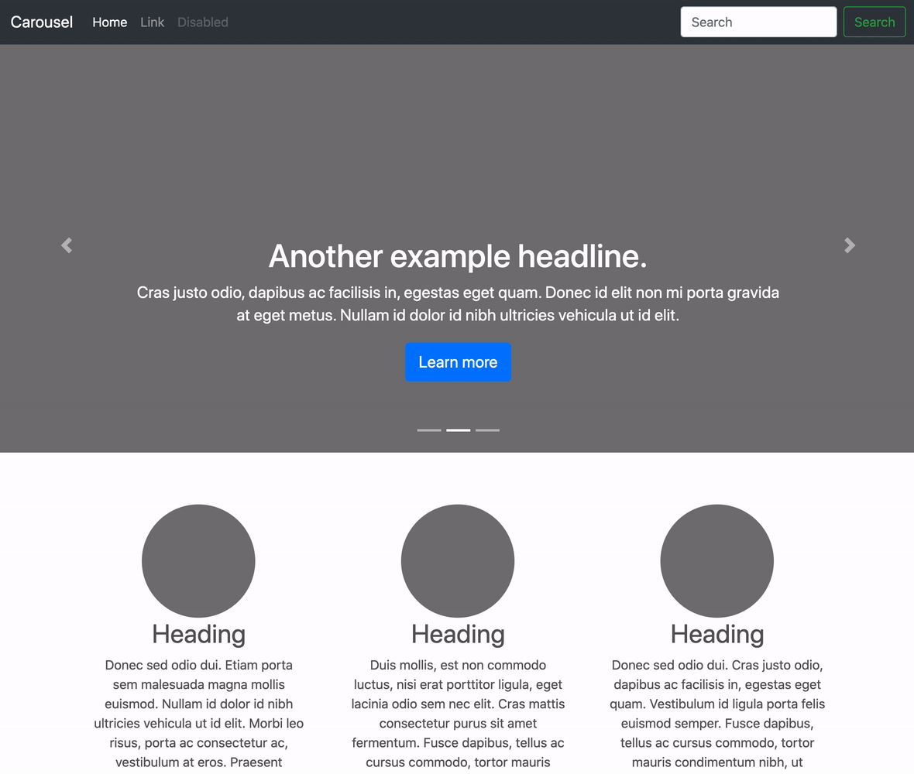
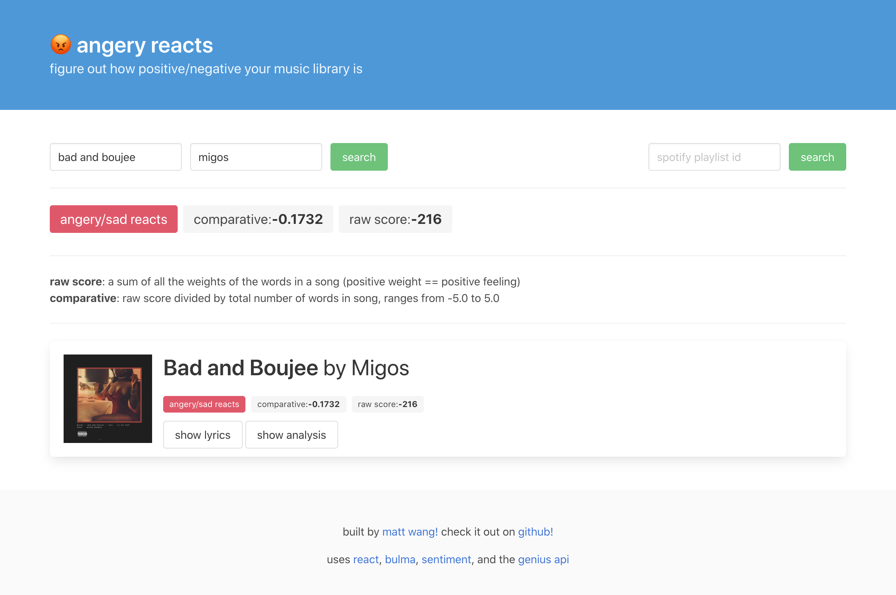
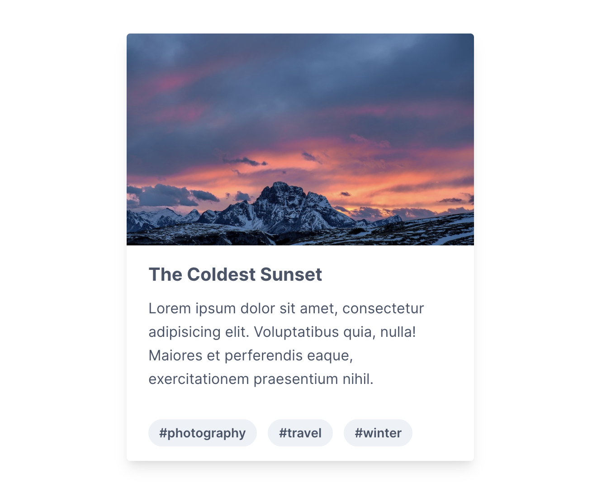

# A Brief Flyover of CSS Frameworks

[Link to video.](https://www.youtube.com/watch?v=akvVfxi_h94)

## Overview/Table of Contents

This set of notes is a brief overview of how to use CSS frameworks and a tour of some popular ones. 

* [Overview/Table of Contents](#overviewtable-of-contents)
* [How to Import a CSS Framework](#how-to-import-a-css-framework)
* [Bootstrap: a primer](#bootstrap-a-primer)
    * [an aside on jQuery](#an-aside-on-jquery)
    * [tl;dr](#bootstrap-tldr)
* [Bulma: a primer](#bulma-a-primer)
    * [tl;dr](#bulma-tldr)
* [Tailwind: a primer](#tailwind-a-primer)
    * [tl;dr](#tailwind-tldr)
* [Some Other Frameworks &amp; Tools](#some-other-frameworks--tools)
* [Final Thoughts](#final-thoughts)

## How to Import a CSS Framework

If you read one thing in this document, it should be this. How would you import any CSS framework?

The answer is exactly like how you'd import your own CSS file. Simply create a `<link>` tag, and point it at the library file!

You have two options:

* host the framework yourself
* use a CDN (content delivery network) <- usually better

Hosting the framework yourself is exactly what you might imagine.

```html
<html>
    <head>
        <link rel="stylesheet" href="/PATH/TO/YOUR/FRAMEWORK">
    </head>
    ...
```

Just download the file, plop it in a folder, and put the path in your `<link>`. Simple enough!

Okay, but why is a CDN better? A **Content Delivery Network** is a fancy term that really means somebody else put lots of effort to *deliver* your *content* very quickly. We won't go into too many details, but basically, the CSS framework is stored somewhere else - when a user boots up your page, their computer makes a request to the CDN to pick up a copy of the framework.

This has two key benefits:

1. The CDN will probably load faster than whatever webserver your app is on - it's designed to!
2. If other websites the user visited **use the same resource**, it will be already cached in their browser, and **a network request doesn't even need to be made!**

That second point is huge, especially for very very common frameworks like Bootstrap or Font Awesome. Chances are, your user has visited another site that uses those very same libraries. If you use the same CDN (and there are typically only a handful or a single recommended one), everybody wins!

The nice thing is that using a CDN is easy as pie.

```html
<!-- this example is taken from the Bootstrap documentation -->
<link
    rel="stylesheet"
    href="https://stackpath.bootstrapcdn.com/bootstrap/4.5.0/css/bootstrap.min.css"
    integrity="sha384-9aIt2nRpC12Uk9gS9baDl411NQApFmC26EwAOH8WgZl5MYYxFfc+NcPb1dKGj7Sk"
    crossorigin="anonymous">
```

Okay, so it looks like you plop a URL into `href` (just like what we'd do for a `<a>` tag). But what about the `integrity` and `crossorigin` properties?

* the `integrity` property contains a SHA-384 checksum, which is a fancy computer algorithm that people use to make sure that the file wasn't changed. Since we don't control stackpath.bootstrapcdn.com, we have no idea what the file actually is - maybe it's a virus! So, the writers of Bootstrap give us a way to check the *integrity* of a file - if the hash of the file doesn't match the checksum, the file isn't loaded. This property is *optional*, but you should use it when you can!
* the `crossorigin` property has to do with something called [CORS](https://developer.mozilla.org/en-US/docs/Web/HTTP/CORS), which is an acronym that no web developer likes. The link will explain it better than we ever can, but the gist of the story is that we need to be nice to people that we borrow resources from (you really should read the link). In some cases (especially with API calls), **CORS is mandatory**. So if the docs tell you to use it, please use it.

Long story short? Follow the documentation!

## Bootstrap: a primer

The first CSS framework we'll talk about is [Bootstrap](https://getbootstrap.com/). Bootstrap is an open-source project that [started as an internal CSS framework at Twitter](https://en.wikipedia.org/wiki/Bootstrap_(front-end_framework)), in an attempt to standardize the site's look and feel - and over the next 8+ years, Bootstrap completely changed the web development game.

Bootstrap's big sell is that it provides a large set of CSS classes to create "components", or pre-made complex layout elements. Take a look at [this example of a classic "pricing page"](https://getbootstrap.com/docs/4.5/examples/pricing/):



This page is entirely built with Bootstrap. It includes several components:

* a responsive [navigation bar](https://getbootstrap.com/docs/4.5/components/navbar/) with alignment and buttons
* a super-sized [display heading](https://getbootstrap.com/docs/4.5/content/typography/)
* a [row](https://getbootstrap.com/docs/4.5/layout/grid/) of [cards](https://getbootstrap.com/docs/4.5/components/card/) with [buttons](https://getbootstrap.com/docs/4.5/components/buttons/)
* a footer with a responsive grid system

Yet, this example has no custom CSS (other than Bootstrap), and all of the HTML content spans only 100 lines. That's insane, given the number of components that this page has! Take a look at *just how easy* it is to make a card with Bootstrap:

```html
<!-- taken from the above example; no extra CSS! -->
<div class="card mb-4 shadow-sm">
    <div class="card-header">
    <h4 class="my-0 font-weight-normal">Free</h4>
    </div>
    <div class="card-body">
        <h1 class="card-title pricing-card-title">
            $0 <small class="text-muted">/ mo</small>
        </h1>
        <ul class="list-unstyled mt-3 mb-4">
            <li>10 users included</li>
            <li>2 GB of storage</li>
            <li>Email support</li>
            <li>Help center access</li>
        </ul>
        <button type="button" class="btn btn-lg btn-block btn-outline-primary">
            Sign up for free
        </button>
    </div>
</div>
```

There are other benefits to Bootstrap too. It has a very convenient flexbox-based grid system, many convenient layout utilities (e.g. vertically centering something, which is notoriously frustrating), a solid set of form controls, and a pre-defined set of colours. Many of its components have interactivity baked-in, so you don't even need to write that much Javascript! And, they're releasing their own [icon set](https://icons.getbootstrap.com/)!



Bootstrap also does a lot of important **good web development practices by default**:

* it places mobile-responsiveness as a priority, building it in to their components so you don't have to!
* it tests strongly for web accessibility (e.g. contrast, screen-reader friendliness), which is important in making the internet more inclusive!
* it handles different browsers gracefully, with fallbacks, vendored prefixes, and polyfills (if you don't know what those mean, don't worry about it).

Finally, Bootstrap is easily customizable. It's built with [SASS](https://sass-lang.com/), which means that you can easily change colors and other parameters, remove components, or add your own features easily!

All of these things means that *tons* and *tons* of websites use Bootstrap. Sometimes, this is a great thing - it means there's a vibrant community around it, with easily-extensible themes and plugins, great documentation, and quick turnaround on bugfixes and new features.

On the downside, it means that your website ... won't look that unique. For some cases, that's ok - not every website needs to be sexy and flashy! But, if you are looking to make your website stand out, the default Bootstrap template is not enough.

The other downside of Bootstrap is that it's **big**. As in, the file size is really big. You need to load in their CSS, their JS, and their JS dependencies (as of v4, jQuery and Popper). That's **a lot of code!** And if you don't use it, all it'll do is slow down your page load, which is not what you want.

At the end of the day, Bootstrap is a great resource, and definitely something you should take for a spin at least once. Then, you can decide if you enjoy using it or not!

### an aside on jQuery

One of Bootstrap's dependencies is [jQuery](https://jquery.com/), a Javascript library. jQuery provides a set of utility functions that make it easier to manipulate the DOM, control events, and make HTTP requests.

jQuery *used* to be really important, as it provided a uniform API across a set of browsers that all implemented JS differently (e.g. Firefox, Chrome, Opera, IE, Edge, Safari, etc.). To do that, it needed to be big - which was an alright price to pay if it meant a kick-ass website.

However, browsers have recently gotten much better at standardizing Javascript (e.g. `fetch` is now standard), which makes jQuery's biggest sell... not that big of a sell anymore. These days, new websites tend to not be made with jQuery, and instead, rely on vanilla JS. In fact, Bootstrap is moving away from jQuery for its `v5`.

So, what does this mean? You might see lots of StackOverflow questions that say "use jQuery", and that might've been the answer 5 years ago, but that shouldn't be the answer anymore. In other words, *you probably don't need jQuery*. **Especially if you're writing a React app.**

(unless you're using Bootstrap `v < 4`. then you have to use it)

### bootstrap tl;dr

* Bootstrap is probably the **most popular CSS framework**. That means there's lots of examples, themes, and StackOverflow questions on how to use it!
* Bootstrap is a huge project! Specifically, it has many **custom components**, its own **icon set**, and custom (but mandatory) **Javascript tools** (among other distinct features).
* Because Bootstrap is so big, you **need to import many large files**.
* Bootstrap is easily customizable with **SASS**.
* There are lots of libraries that add-on to Bootstrap, or implement Bootstrap in React/Angular/Vue/etc.
* Since *so many people use Bootstrap*, the default theme doesn't look very unique.
* Bootstrap has a veteran release time behind it. You'll rarely find bugs, they cover lots of accessibility use cases, and when needed, they iterate and bugfix quickly.

## Bulma: a primer

[Bulma](https://bulma.io/) is another popular open-source CSS framework, originally made by [Jeremy Thomas](https://jgthms.com/). Similar to Bootstrap, it provides a set of CSS utilities, a convenient grid system, and pre-defined components to make your life easier. It's customizable with SASS, and lets you selectively import what you need.

Here's an example of a quick web-app I made with Bulma:



How does Bulma compare to Bootstrap? There are a few core differences:

1. Bulma is **smaller and lighter** than Bootstrap. It has less utilities and components than Bootstrap (e.g. no [Carousel](https://getbootstrap.com/docs/4.5/components/carousel/), [List Group](https://getbootstrap.com/docs/4.5/components/list-group/), or [Toasts](https://getbootstrap.com/docs/4.5/components/toasts/)).
2. Bulma has **no Javascript**. That means that you don't need jQuery, but it also means that you need to code things like a [modal popping up](https://getbootstrap.com/docs/4.5/components/modal/) yourself!
3. Bulma is mostly maintained by one person, rather than a large team of contributors. This means that it's slower to receive updates and bugfixes. In fact, it hasn't even reached `v1` yet!

Which one you'll need can depend on your project! If you know your app is going to be dead-simple, and you won't need any complex components or JS plugins, then something like Bulma is probably more suited for your application. If you know you're going to be building many complex views, choosing Bootstrap can save you lots of time.

But, at the end of the day, it really is up to you. The only people who say "never use X" or "always use X" in the realm of CSS frameworks are people who aren't worth listening to.

### bulma tl;dr

* Bulma is another **wildly popular CSS framework**, which means that there's a solid community (including plugins) for it!
* Unlike Bootstrap, Bulma is **CSS only**: you aren't importing jQuery, Popper, or a custom JS file.
* Bulma is also lighter than Bootstrap: it has less out-of-the-box components (like a carousel), which can be good or bad!
* Bulma is also easily customizable with **SASS**.
* Bulma is open-source, but is still primarily developed by one person - that makes it slower to update than Bootstrap.

## Tailwind: a primer

[Tailwind](https://tailwindcss.com/) is a CSS framework with an entirely different approach. Instead of providing you with pre-made components, Tailwind is *just utilities*. You combine the utilities to create components, exactly how you want them.

This is what a [card](https://tailwindcss.com/components/cards/) might look like in Tailwind:

```html
<div class="max-w-sm rounded overflow-hidden shadow-lg">
  
  <div class="px-6 py-4">
    <div class="font-bold text-xl mb-2">The Coldest Sunset</div>
    <p class="text-gray-700 text-base">
      Lorem ipsum dolor sit amet, consectetur adipisicing elit. Voluptatibus quia, nulla! Maiores et perferendis eaque, exercitationem praesentium nihil.
    </p>
  </div>
  <div class="px-6 py-4">
    <span class="inline-block bg-gray-200 rounded-full px-3 py-1 text-sm font-semibold text-gray-700 mr-2">#photography</span>
    <span class="inline-block bg-gray-200 rounded-full px-3 py-1 text-sm font-semibold text-gray-700 mr-2">#travel</span>
    <span class="inline-block bg-gray-200 rounded-full px-3 py-1 text-sm font-semibold text-gray-700">#winter</span>
  </div>
</div>
```



The end result is pretty similar in design language to the cards that we saw in Bulma and Bootstrap, but the way we got there was really different!

Tailwind, frankly speaking, is not exactly beginner friendly: you need a strong grasp of CSS fundamentals like `padding`, `margin`, `display`, `overflow`, `background`, etc. That being said, being really good with Tailwind is like being really good with Emacs - there aren't many people who do it, and they're scarily good with it.

Tailwind has other trickle-down benefits: it's a lot lighter than Bootstrap and Bulma (since there are no components, at all!), and it's significantly more customizable. Migrating between versions is dead simple, as is using it with other libraries.

### tailwind tl;dr

* Tailwind does not have components: it is **utility-first** and **utility-only**
* Tailwind is **extremely flexible** and **customizable**
* Tailwind has a very *steep* learning curve

## Some Other Frameworks & Tools

Here are some other cool things you can look into if you're interested:

* [Font Awesome](https://fontawesome.com/) is probably the web's most popular standalone icon framework! It has a free and a paid tier (the latter has more icons and styles)
* [Material Design](https://material.io/design) is Google's design framework, and they have pre-built components, icons, and design layouts made just for you!
* [Tachyons](http://tachyons.io/) is a cool CSS framework that also supports CSS variables with a simple plugin!
* [Semantic UI](https://semantic-ui.com/) is another very popular Bootstrap-like CSS & JS component framework.
* [Water.css](https://watercss.kognise.dev/) is a CSS framework that only modifies element tags (it introduces no classes). It's very useful when you're making generated HTML content.
* [instagram.css](https://github.com/picturepan2/instagram.css) implements Instagram filters in CSS.
* [loaders.css](https://connoratherton.com/loaders) is one fun collection of CSS loading animations
* [Highlight.js](https://github.com/highlightjs/highlight.js) is a JS framework that can help you do automatic syntax highlighting with CSS classes! To use it, you don't need much JS knowledge, so have no fear!

## Final Thoughts

At the end of the day, there is no *right* or *wrong* CSS framework! The one that you pick is a combination of the needs of your project, the design language of the framework, and personal preference. You also can choose not to use one at all - that's what we do for the Teach LA website! You should use whatever tool system and setup *makes sense for you*.
