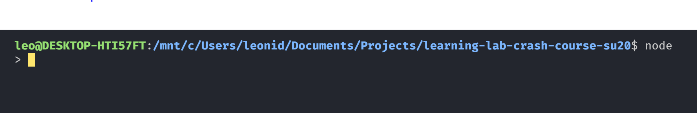
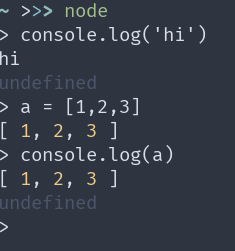
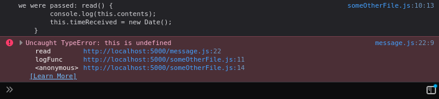
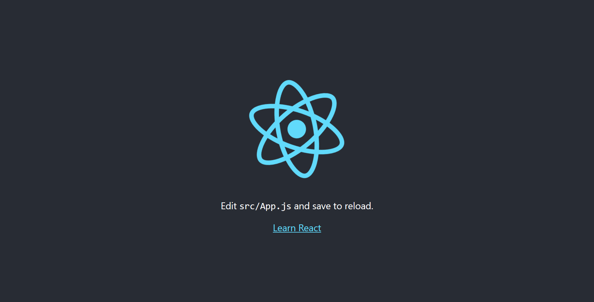
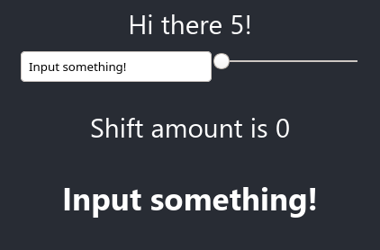
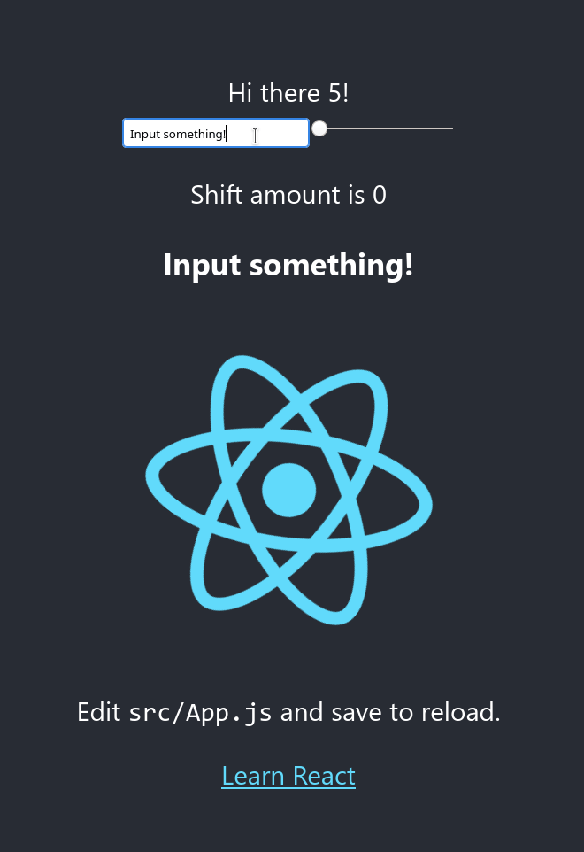

# Introduction to React

[Link to Video.](https://www.youtube.com/watch?v=3UKF9qMBIzA)

With Leo and Matt, we will learn all the basics to the model citizen of JavaScript frameworks, React! That might sound like a garbled mess, but I promise by the end of this, you will understand the following:
* How to install node
* What node, NPM, and React are.
* [`create-react-app`](https://github.com/facebook/create-react-app), and how its template is a good demo
* Classes in JS
* Modules in JS
* Render
* State and props
* How to make your own component (with styling)
* Mention Project #2 (probably a to-do list)

Once you're through with this lesson, you should be able to explain...
* What node and NPM are
* Explain why React is popular
* Bootstrap your own webapp with [`create-react-app`](https://github.com/facebook/create-react-app)
* Create your own components for that React app
* Add dependencies to your app
* Start thinking about how you might write project #2.

## Node and NPM

### What are Node and NPM?

Nodejs is a runtime that brings JavaScript code out of the browser and into your hardware. This enables a wealth of possibilities, as JavaScript code suddenly is enabled to interface with common I/O operations and user-level applications!

NPM stands for **Node Package Manager**. This is the tool used to manage package installation and dependency for Node applications. It has a registry of over 800,000 packages at its disposal.

### How do I install Node (and NPM)?

You can install Node and NPM from a single installer that you can find at the [downloads page of nodejs.org](https://nodejs.org/en/download/). If you're on a *nix operating system, then things depend on your flavor's primary package manager. You can find installation guides for all kinds on the same page.

Installed with defaults, this will install **both nodejs and npm**.

### How do I use node?

Easy enough! Just open up a terminal on your computer and run the command `node`. If it is installed properly, you should be presented with a console:



Now, we can run any piece of JavaScript code that we might want to from within the terminal:



### How do I use NPM?

NPM is a slightly different story. It is a command that is used to control dependencies of certain packages on other ones.

First, to initialize a package in your current directory, you can use `npm init`. This will lead to a number of questions about what the name of your package will be, the author information, license, and the like. Here's example output of initializing a package in `modules-demo`:

```sh
This utility will walk you through creating a package.json file.
It only covers the most common items, and tries to guess sensible defaults.

See `npm help init` for definitive documentation on these fields
and exactly what they do.

Use `npm install <pkg>` afterwards to install a package and
save it as a dependency in the package.json file.

Press ^C at any time to quit.
package name: (modules-demo) 
version: (1.0.0) 
description: My first package!
entry point: (someOtherFile.js) 
test command: 
git repository: git@github.com:uclaacm/learning-lab-crash-course-su20.git
keywords: education
author: Teach LA <acmteachla@gmail.com>
license: (ISC) MIT
About to write to /data/repos/learning-lab-crash-course-su20/07-intro-react/modules-demo/package.json:

{
  "name": "modules-demo",
  "version": "1.0.0",
  "description": "My first package!",
  "main": "someOtherFile.js",
  "scripts": {
    "test": "echo \"Error: no test specified\" && exit 1"
  },
  "repository": {
    "type": "git",
    "url": "git+ssh://git@github.com/uclaacm/learning-lab-crash-course-su20.git"
  },
  "keywords": [
    "education"
  ],
  "author": "Teach LA <acmteachla@gmail.com>",
  "license": "MIT",
  "bugs": {
    "url": "https://github.com/uclaacm/learning-lab-crash-course-su20/issues"
  },
  "homepage": "https://github.com/uclaacm/learning-lab-crash-course-su20#readme"
}


Is this OK? (yes)
```

To add a dependency to our package, we simply find the name of the package, say, `bulma`, and install it with: `npm install --save bulma`. The `--save` flag saves the dependency to our `package.json` that we just generated with `npm init`.

#### Global installation

You can also install packages to use natively in your own terminal with `npm install -g <packagename>`, where `-g` means **global**. If you're on Linux, you will likely have to use `sudo npm install -g`.

As a nice transition to React, let's globally install the tool we'll use to bootstrap our application: `npm install -g create-react-app`.

## Background: Classes and Modules

We left out two concepts that are essential to modern JavaScript in [our lecture introducing it](../03-intro-js/README.md): **classes** and **modules**. These two will be made extensive use of in Node and React, so let's dig into them first.

### Classes

Recall that the official definition of JavaScript mentions that it is object-oriented. If you've coded in another programming language before, you've likely seen this done many times before. What's more, we've already experimented with objects, a generalist class:

```js
const exampleObject = {
    a: 2,
    b: 3,
    c: 4,
    d: 'some string'
};
```

For a quick refresher on the motivation behind classes, though:

Imagine that we have a number of data points that we want to group together under a single data type. For example, if I send a text message to someone, the data types we'd like to house in a single `Message` type would include some things like...
* Sender
* Recipient
* Contents of the message

Let's mock this up with a class in JavaScript.

```js
// message.js
class Message {
    constructor(sender, recipient, contents) {
        this.sender = sender;
        this.recipient = recipient;
        this.contents = contents;
    }
}
```

Notice that, like Python, we don't declare any data members, but rather that we declare their existence in the class constructor. Compare this to the same class in C++:

```cpp
class Message {
public:
  Message()
    : _timeSent(0), _timeReceived(0), _sender(), _recipient(), _contents() {}

private:
  double _timeSent, _timeReceived;
  std::string _sender, _recipient, _contents;
}
```

Similarly to C++, we create instances of classes with the `new` keyword:

```js
let myMessage = new Message();
```

This opens up new doors. Say we wanted to add the time sent to our Message. Then we could create a new `Date` object that tracks the time it was created. Speaking of...

#### Extending the Message Type

What are some other things we'd like for a message to do?
* Send
* Read

The first thing that likely comes to mind when thinking of ways to model these features is **functions**. Luckily, JavaScript allows us to make member functions very easily:

```js
// message.js
class Message {
    constructor(sender, recipient, contents) {
        this.sender = sender;
        this.recipient = recipient;
        this.contents = contents;
    }

    send() {
      // send the message to a server or something
      console.log('sent the message to ' + this.recipient);
    }

    read() {
      console.log(this.contents);
    }
}
```

If we wanted to implement the timestamping behavior previously described, we can do that as well!

```js
// message.js
class Message {
    constructor(sender, recipient, contents) {
        this.sender = sender;
        this.recipient = recipient;
        this.contents = contents;
        this.timeSent = null;
    }

    send() {
      // send the message to a server or something
      this.timeSent = new Date();
      console.log('sent the message to ' + this.recipient);
    }

    read() {
      console.log(this.contents);
    }
}
```

#### Static methods

We also have static methods as one might expect in any 'ol OOP. We just have to declare them with a prefix of `static`:

```js
// message.js
class Message {
    constructor(sender, recipient, contents) {
        this.sender = sender;
        this.recipient = recipient;
        this.contents = contents;
        this.timeSent = null;
    }

    static from(someString) {
        let m = new Message();
        m.contents = someString;
        return m;
    }

    send() {
        console.log('sent the message.');
        this.timeSent = new Date();
    }

    read() {
        console.log(this.contents);
        this.timeReceived = new Date();
    }
}
```

In the above example, we add a static method that generates a `Message` from some string.

#### Getters and Setters

We can define certain functions to be exclusively used for getting and setting variables of a class instance by prepending `get` or `set` to our functions, respectively:

```js
// message.js
class Message {
  // ...
  get content() {
    return this.contents;
  }

  set content(c) {
    return this.contents = c;
  }
}
```

#### Binding functions

Now wait, there are some problems that might emerge down the line. Say that I am writing a file that uses my Message type, and expects to be passed the `send` method of a specific `Message` instance to be called. Or better yet, lets say that I am writing a function that simply calls another function at some point:

```js
function logFunc(f) {
  console.log('we were passed: ' + f);
  f();
}
```

This is where our problem emerges.
* If we create a new Message instance: `let m = new Message('Leo', 'Matt', 'Howdy! 🤠');`
* And then try running something like `logFunc(m.read)`.

Uh oh! We have output that looks like this:



You see, when we pass around functions as parameters, the `this` keyword that we rely on in OOP is lost. Thus, referring to `this` is referencing an undefined value!

Have no fear! JavaScript, in its jank wisdom, solves this problem by providing us with `funcName.bind(objName)`. This function returns a copy of the function `funcName`, but where the function's `this` keyword is replaced with a reference to `objName`.

So if we run the sequence:
* `let m = new Message('Leo', 'Matt', 'Howdy! 🤠');`
* `let boundFunc = m.read.bind(m);`
* `logFunc(boundFunc);`

We have no error. Excellent.

### Modules

Remember how we mentioned a while back that `namespace` isn't a concept in JavaScript, but there was something *kind of* like it? Enter the world of modules.

JavaScript may not have explicit namespaces, but we *can* export functions and types from specific files to allow for the easy inclusion of our libraries in other scripts. This is the principle that NPM works on!

Let's say that we want to make our `Message` type from earlier a type that other JavaScript files can include. That's easy enough! Just prepend to it the `export` keyword:

```js
// message.js
export class Message {
    // ...
}
```

Then, to include it in another file, we simply place `import Message from '/path/to/module.js` at the start of the file that uses it. For example:

```js
// someOtherFile.js
import Message from './message.js';

console.log(Message.from('this is a test message!'));
```

If we have multiple things we wish to export at a given time, we can do so all at once with a single `export` statement at the bottom of the module using curly braces:

```js
// message.js
class Message { /* ... */ }
function anotherThing() { /* ... */ }
function somethingElse() { /* ... */ }

// ...

export { Message, anotherThing, somethingElse };
```

Likewise, if we have multiple things that we wish to import at a given time from a single module, we can do so with a single `import` statement at the start of the file using curly braces:

```js
// someOtherFile.js
import { Message, anotherThing, somethingElse } from './message';

// ...
```

As a final note, there also exists a **single default export per each module**. This default export does exactly what it says on the tin: when you import a module, the default export will be the one that is imported with the specified name.

For example:

```js
// myMod.js
function coolFunc() { /* ... */ }
function otherFunc() { /* ... */ }

export default coolFunc;

// myOtherFile.js
import coolFunc from './myMod';

coolFunc(); // calls coolFunc.
```

Notice that we don't use curly braces for the use of this function.

This is made extensive use of in React, which we'll talk about right now.

## So what is React? Why is it so popular?

React is **a library for building user interfaces. It is declarative, component-based, and "learn once, write anywhere"**. Here's what all those terms mean:
* **declarative**: your code is free to *describe* what it does, rather than implement every little detail. Think of it as the difference between writing HTML and writing C++.
* **component-based**: your interface will be compartmentalized into discrete components.
  * This makes life easier for us down the line, since our code will be far more maintainable. Imagine if Facebook kept all it's interface code in a single HTML file!
* **"learn once, write anywhere"**: your code will work regardless the other technologies you use. Additional features are painless.

### But why is it so popular?

Sure, there are other libraries out there like Vue and Angular (or Svelte), but React has amassed insurmountable popularity primarily because of one feature that it brought to the table:

**React only updates what needs to be updated**

Allow me to reiterate this. This is the thing that made React so popular:

**React will only update what needs to be updated in your interface**

What this means is that if you are running something that handles a ridiculous amount of data, like [Open MCT](https://nasa.github.io/openmct/), every time a new piece of data comes in, you don't have to update every single element of the interface.

Of course, it always helps when your technology is built by Facebook and open-sourced, as well.

## `create-react-app`

Recall that we installed an NPM package called `create-react-app` earlier in this lesson that we mentioned we'd use later on. Well, the time has come to use it!

`create-react-app` is a tool made by Facebook that **bootstraps** (see: sets up) an NPM package with handy scripts, all the dependencies you need, and a sample app for you to get started with! All we need to do to create our app is run:

```sh
create-react-app <folderName>
```

Note: if you get the message `npm WARN config global --global, --local are deprecated. Use --location=global instead.`, [edit the nodejs files accordingly](https://stackoverflow.com/questions/72401421/message-npm-warn-config-global-global-local-are-deprecated-use-loc).

Once this runs, you'll create a new package with all the dependencies for a react app already installed, and a handful of scripts to run, test, and build your app at your disposal. More specifically,
* We can serve the project locally with `npm start`
* We can build the project for production with `npm build`
* We can run any tests we have written with `npm test`

Let's run the demo. Change directories into the folder we just made, and run `npm start` or `npm run start`. This will begin serving the application on a development server so that we can see what the app looks like at present.

You should get a page that looks like:



Let's investigate how this all works.

## Understanding the `create-react-app` demo

Well, judging by the fact that the webpage tells us to "Edit src/App.js and save to reload.", why don't we do just that?

Navigate in your package folder to [src/App.js](src/App.js). Once in, we can see what it is that React wants us to edit:

```js
import React from 'react';
import logo from './logo.svg';
import './App.css';

function App() {
  return (
    <div className="App">
      <header className="App-header">
        
        <p>
          Edit <code>src/App.js</code> and save to reload.
        </p>
        <a
          className="App-link"
          href="https://reactjs.org"
          target="_blank"
          rel="noopener noreferrer"
        >
          Learn React
        </a>
      </header>
    </div>
  );
}

export default App;
```

Pretty short and sweet! If we change something in the file, we can see that the webpage on our browser will automatically reflect our changes. So what does this demo tell us?
* We can return HTML as easily as anything else.
* We can import CSS files and others - not just JS - to our code.
  * Notice we import `./App.css`, and its styles are applied to the component.
  * Notice how we import `logo.svg` as `logo` and then use it later as a value: `src={logo}`.
* Some of our HTML properties exist under a different name.
  * `class` becomes `className`, for example.

### HTML in JS: JSX

The first thing that we mentioned is one of React's great parts. This is something called JSX. It allows us to pass around HTML as easily as anything else in React.

If we are passing it around, though, it needs to all be contained in a single container tag. Notice how our return statement up above wraps it in a `<div>` tag?

In any case, let's change up the structure a little bit by adding in an `<h1>` tag:

```js
// ...
      <header className="App-header">
        
        <h1>Hello</h1>
        <p>
          Edit <code>src/App.js</code> and save to reload.
        </p>
// ...
```

Better yet, let's try adding in the header tag but use a variable:

```js
// ...
function App() {
  const greeting = "Hello";

  return (
    <div className="App">
      <header className="App-header">
        
        <h1>{greeting}</h1>
// ...
```

This is where things get interesting. We can intersperse JavaScript results throughout our JSX by encapsulating them with curly braces. In this case, we used a variable, but we can use any output we wish. Consider using a function, for example:

```js
<h1>{function(g) { return g + 'extra'; }(greeting)}</h1> # TODO
```

Certainly unconventional, but it works. This takes our constant `greeting` and appends `'extra'` to it.

A common pattern you'll see in JSX is use of ternary:

```js
<h1>{greeting ? greeting : 'hello'}</h1>
```

If the value `greeting` is truthy, then it will be returned. Otherwise, 'hello' is returned. This is handy for dealing with values we might not be sure exist.

#### Things that were renamed

There are a few properties from HTML that have been renamed in React's JSX. That is, there are a few **DOM elements** that have been renamed. Here are example changes from what we've learned for reference:
* `class` -> `className`
* `onchange` -> `onChange`

Notice the trend? **DOM element names have just been made camel-cased**. That's all there is to it! A more complete list (including how inline styling has changed), can be found [here](https://reactjs.org/docs/dom-elements.html).

### Including other files

We can include other files in our React components very easily through `import` statements, just like ES6 modules.

Typically for a React component, this means that we style our JSX through a CSS file. In the case of our App component, this is `App.css`.

## Creating our own component!

Let's take all that we've learned through this lesson to create two simple React components: a greeter and a caesar cipher encoder.

## Creating a greeter

We can create React components through functions. The easiest way of doing this is by importing the `React` module `from 'react'` (which we installed with npm) and declaring a function that takes a single parameter of `props` and returns some JSX.

**At their core, React components are functions that operate on properties (`props`)**. We make direct use of this in the below example:

```js
// Greeter.js
import React from 'react';

function Greeter(props) {
  return (
    <div className="my-component">
      Hi there { props.name }!
    </div>
  )
}

export default Greeter;
```

Notice that we `export default` at the end of the file. This is to ensure that our function is the default import.

### Using the greeter

Now, to put this greeter on our page. All there is to it is importing the file as we would any other module in JavaScript to our `App.js` and then, the magic happens:

```js
import React from 'react';
import logo from './logo.svg';
import './App.css';
import Greeter from './Greeter.js';

function App() {
  return (
    <div className="App">
      <header className="App-header">
        <Greeter name='world' />
        
        { /* ... */ }
}

export default App;
```

Reload your page and you can take a peek that our Greeter has been drawn to the page:


In this case, the `props` that we passed down is an Object created from the keys and values that we use as the HTML properties of the function. In this case, all we have is `name='world'`, but we could pass down very complicated properties if we'd like! In fact, we could pass down functions or more JSX.

This same declaration is used to draw our `App` component. If you take a look at our entry point of `index.js`, we create the entire app through call of `<App />`.

### Unexpected props

What happens when we get unexpected props though? Let's try:

```js
<Greeter name={5} />
```

Note the use of curly braces to separate our raw JavaScript Number from the JSX.

We will get this:


How come this happened? **The value was coerced**. That is, our Number of `5` was changed to its string equivalent.

While nothing bad happened in this case, if you expected a slightly different value, like a function, you'll get some strange behavior in your App, or even a crash.

For this reason, make sure that the props you are passing down are supported, **or better yet**, always check in your components that the types are as expected, and complain otherwise.

You can actually do a great deal with these simple **functional components** like the Greeter, thanks in large part to anonymous functions in JS. But, as components gain more and more complex behavior, we will want to start using classes.

## Creating a shifter

Sometimes, though, functions are not enough. We want to be able to work with things that are slightly more robust - **things with state**.

For this, we make use of the `React.Component` type. A `React.Component` is the base type that all others extend from, providing the necessary functions and data such that React knows when to update each particular component.

This provides us with another part that makes React phenomenal, being state.

Each component in React, in addition to props, makes use of an internal state to track updates to its data over time.

### Creating the Class

First, we have to create our class for the component. This means that we have to create a class that extends `React.Component`. It should have a constructor and a render function. We'll put this in a new file, `Caesar.js`.

```js
// Caesar.js
import React from 'react';

class Caesar extends React.Component {
  constructor(props) {
    super(props);
  }

  render() {
    return (
      <div className='caesar-shift'>
        Hey there!
      </div>
    )
  }
}

export default Caesar;
```

Let's talk about each part of this new type.

### The constructor

Like a typical class in OOP, our React components have a constructor. This is where the props that we typically pass down are handled for a class.

Notice that we first call `super(props)`. This is to initialize the parent class of the object (if one exists).

This is also where we set the state for our component for later use.

Though there isn't anything in the constructor right now, there will be soon!

### The `render` function

Each React component has a render function that is called by the library when the component needs to be drawn to the screen. That is, when the component is created or when its props or state are updated.

This is where we put what would go in our standard function definition of a component. For example, the class version of our Greeter from earlier would look like:

```js
import React from 'react';

class Greeter extends React.Component {
  render() {
    return (
      <div className="my-component">
        Hi there { props.name }!
      </div>
    )
  }
}

export default Greeter;
```

Notice how we made use of the props for the components, just like we did previously. Also note that **we omitted the constructor** since it wasn't doing anything. When you are omitting the constructor, it's usually a good sign that you can make your component a function. Bear that in mind!

### Mocking up the component

Now that we understand what the constructor and render functions do for our component, let's sketch out the skeleton for our caesar shifter component:

```js
// Caesar.js
class Caesar extends React.Component {
  constructor(props) {
    super(props);
  }

  render() {
    return (
      <div className='caesar-shift'>
        { /* we need to acquire input to be shifted */ }
        <input type='text' value={???} onChange={???} />

        { /* we need somewhere for the user to choose the shift amount */ }
        <input type='range' min='0' max='25' value={???} onChange={???} />

        { /* we need somwhere to show the shift amount */ }
        <p>Shift amount is ???</p>

        { /* we need to output the shifted text somewhere */ }
        <h3>{???}</h3>
      </div>
    )
  }
}
```

With this out of the way, we can fill in the blanks.

### Component State

Each component in React has its own state, which can be updated, unlike its properties. To initially set the state, we do so in the constructor, as though it were a data member.

```js
// Caesar.js
class Caesar extends React.Component {
  constructor(props) {
    super(props);

    this.state = {
      plaintext: 'Input something!',
      shAmt: 0,
      output: 'Input something!',
    };
  }

  render() {
    return (
      <div className='caesar-shift'>
        { /* we need to acquire input to be shifted */ }
        <input type='text' value={this.state.plaintext} onChange={???} />

        { /* we need somewhere for the user to choose the shift amount */ }
        <input type='range' min='0' max='25' value={this.state.shAmt} onChange={???} />

        { /* we need somwhere to show the shift amount */ }
        <p>Shift amount is {this.state.shAmt}</p>

        { /* we need to output the shifted text somewhere */ }
        <h3>{this.state.output}</h3>
      </div>
    )
  }
}  
```

Let's draw this to our page by putting it in our `App.js`, removing the ??? parts so that it will build:



This allows us to set sane defaults for the input fields, and bind them to a single source of truth: the component's state. This is a critical concept in React that permeates the design of the entire library. The component state should be the **only** source of truth.

Next up for the blanks: `onChange`. When the input values for our shift amount or the input text change, we will need to update the state. We can do this easily by creating some member functions to call, and binding them to the class.

**Q: Why are we binding them?**

**A: If we pass the functions as arguments, we need these functions to have knowledge of our `this` keyword.**

```js
// Caesar.js
class Caesar extends React.Component {
  constructor(props) {
    super(props);

    this.state = {
      plaintext: 'Input something!',
      shAmt: 0,
      output: 'Input something!',
    };

    // bind our functions
    this.onTextChange = this.onTextChange.bind(this);
    this.onRangeChange = this.onRangeChange.bind(this);
    this.computeShifted = this.computeShifted.bind(this);
  }

  onTextChange(e) {
    this.setState({
      plaintext: e.target.value,
    });
  }

  onRangeChange(e) {
    this.setState({
      shAmt: e.target.value,
    });
  }

  render() {
    return (
      <div className='caesar-shift'>
        { /* we need to acquire input to be shifted */ }
        <input type='text' value={this.state.plaintext} onChange={this.onTextChange}>

        { /* we need somewhere for the user to choose the shift amount */ }
        <input type='range' min='0' max='25' value={this.state.shAmt} onChange={this.onRangeChange}>

        { /* we need to output the shifted text somewhere */ }
        <h3>{this.state.output}</h3>
      </div>
    )
  }
}  
```

The argument to the functions is an event named `e`. To get the value of the updated component, we retrieve it through `e.target` (the target of the event)'s `.value`.

Notice that we update the component state through a call to the function `this.setState`. This is provided by React to allow us to update parts of the state safely, and ensure that if we have multiple state updates, they get batched. It also prevents direct mutation!

But wait, aren't we missing the last piece of the puzzle here? **The actual shift!**

Easy enough, let's write a function for that which pulls from our state to compute the shifted text.

```js
// Caesar.js
class Caesar extends React.Component {
  constructor(props) {
    super(props);

    this.state = {
      plaintext: 'Input something!',
      shAmt: 0,
      output: 'Input something!',
    };
  }

  computeShifted() {
    let newString = "";
    for (let c of this.state.plaintext) {
      newString += String.fromCharCode(c.charCodeAt(0) + this.state.shAmt);
    }

    this.setState({
      output: newString,
    });
  }

  // ...
}
```

And, finally, we need to call this function each time we change the state:

```js
// Caesar.js
  onTextChange(e) {
    this.setState({
      plaintext: String(e.target.value),
    });
    this.computeShifted();
  }
  
  onRangeChange(e) {
    this.setState({
      shAmt: Number(e.target.value),
    });
    this.computeShifted();
  }

  computeShifted() {
    let newString = "";
    for (let c of this.state.plaintext) {
      newString += String.fromCharCode(c.charCodeAt(0) + this.state.shAmt);
    }

    this.setState({
      output: newString,
    });
  }
```

**Q: Why didn't we need to bind our `computeShifted` function?**

**A: It already has knowledge of the `this` keyword when it is called by a bound function.**

In any case, when we open up our app, now we will have a working component! Let's add this to our page:

```js
import React from 'react';
import logo from './logo.svg';
import './App.css';
import Greeter from './Greeter';
import Caesar from './Caesar';

function App() {
  return (
    <div className="App">
      <header className="App-header">
        <Greeter name={5} />
        <Caesar />
        
        <p>
          Edit <code>src/App.js</code> and save to reload.
        </p>
        <a
          className="App-link"
          href="https://reactjs.org"
          target="_blank"
          rel="noopener noreferrer"
        >
          Learn React
        </a>
      </header>
    </div>
  );
}

export default App;
```

And here's what the page looks like altogether:



If you pay close attention to this, though, you'll see that the input actually "lags" behind our current displayed value by one change. This is because of how React batches its updates to the page when calls to `setState()` are made. `setState()` creates a **pending** change to the component state. It does not instantly act on it.

The devil is in the details. **We'll address how to handle situations like these briefly in our next talk about React**, where we discuss callback functions!

# Resources

There is no way we could possibly cover all of this material in a single README, so here are a variety of resources for you to check out at your leisure!

## Node, NPM
* [tutorialspoint's piece on "What is Node?"](https://www.tutorialspoint.com/nodejs/nodejs_introduction.htm)
* [How to publish your own package to NPM](https://docs.npmjs.com/packages-and-modules/contributing-packages-to-the-registry)

## Classes and Modules
* Classes
  * [MDN's reference guide to ES6 classes](https://developer.mozilla.org/en-US/docs/Web/JavaScript/Reference/Classes)
  * [JavaScript's private class fields (new material, worth a read!)](https://www.sitepoint.com/javascript-private-class-fields/)
  * [Even newer, the **proposed** addition of public and private class fields to JavaScript](https://github.com/tc39/proposal-class-fields#private-fields)
* Modules
  * [MDN's reference guide on modules](https://developer.mozilla.org/en-US/docs/Web/JavaScript/Guide/Modules)
  * [tutorialspoint's guide to exports](https://www.tutorialspoint.com/es6/es6_modules.htm)
* Bind
  * [JavaScript's bind method uses and practical applications](https://www.javascripttutorial.net/javascript-bind/)
  * [The MDN reference for Function.prototype.bind](https://developer.mozilla.org/en-US/docs/Web/JavaScript/Reference/Global_objects/Function/bind)

## React
* [React's official guide to getting started](https://reactjs.org/docs/getting-started.html)
* [React docs on the React.Component interface](https://reactjs.org/docs/react-component.html)