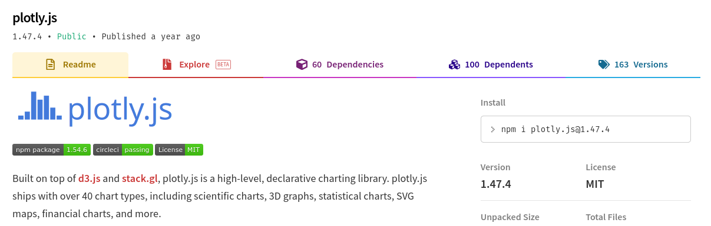

# JS Libraries

[Link to Video.](https://youtu.be/uGns9G4Bh70)

In this chat with Leo, we'll discuss the wonderful world of JavaScript libraries, and how you can use them in your project and add them as a dependency. We will discuss graphing libraries, font packs, math libraries, and animation ones too!
* Graphing with plotly
* Icons with fontawesome
* Numpy-like math with numjs
* Animation with animejs

By the end of this, we should know how to...
* Pick out the right library to use
* Add it as a dependency
* Use it in our React app

## Picking a Library

Now I'm sure that you've all heard this before, but if you haven't then listen up! There are a few things that one should always consider when picking out a library for use in a webapp. They come in the form of questions:
* Does this library do what I want it to?
* Does this library *look nice*?
* Is the documentation clear?
* Is the interface easy to use? Or is it cumbersome?

If you can answer these questions with a confident "yes", then the library is a good contender! Make sure to compare a number of libraries before you do, though.

There's also often a trade-off between ease-of-use and control. If you want something that is incredibly detailed and allows you to handle every facet of the operation, you're going to sacrifice a good deal of ease-of-use, since the abstractions provided by a library are what we look for to begin with.

In any case, with that out of the way, let's take a look at a few JavaScript libraries that you might want to use in your project. More specifically, we'll look at how we can use them in a React webapp.

## Adding the library as a dependency

Adding a library to your node project is fairly easy. All you have to do is run `npm install --save PACKAGENAME`. For example, if we wanted to install `plotly`, a plotting library, we can just look it up on NPM:



Then we can run the specified command. In our case, this means `npm install --save plotly.js`. This will automatically install the latest version for us. If a library is broken at a particular version number, you can always install a specific version with `npm install --save plotly.js@version.number`, but you shouldn't need to ever do this.

However, some packages will provide React-specific bindings. This is just another way of saying that they provide abstractions for their data types and interfaces that are friendly to use in React components. In the case of plotly, this package is named `react-plotly.js`. We'll want to install that one for our purposes.

Then, to use the package in your code, just `import` it in the same way that one would import any other module.

## `plotly`: plotting

With that out of the way, let's add plotly as a dependency to our project! Change directories to our project, `npm install --save react-plotly.js plotly.js` and we're off!

[Plotly](https://plotly.com/javascript/) is a great library for visualizing data. Creating a simple plot is easy enough, with its attributes specified through the `data` prop.

```js
import Plot from 'react-plotly.js';

<Plot
    data={[
          {
            x: [1, 2, 3],
            y: [4, 5, 6],
            type: 'scatter',
            mode: 'lines+markers',
            marker: {color: 'blue'},
          }
    ]}
/>
```

There are a number of graph types and modes for you to explore over at the [docs](https://plotly.com/python/basic-charts/). There are also plenty of other libraries to use out there. Plotly's API can be a little unwieldy, so it's worthwhile looking around!

Note: while testing for this README, create-react-app kept complaining about a lack of memory on the heap. Plotly uses a great deal of it, so to remedy it, simply add the flag `--max_old_space_size=4096` or more in your package.json [as shown here](jslib/package.json).

## `fontawesome`: icons!

But what if we want to add some icons to our webapp to boost some of our microinteractions? We can do that too. All we need to do is install the fortawesome series of free icon packs: `npm install --save @fortawesome/fontawesome-svg-core @fortawesome/free-solid-svg-icons @fortawesome/react-fontawesome`.

Referencing the [documentation provided on the registry listing](https://www.npmjs.com/package/@fortawesome/react-fontawesome#usage), we can see that the usage is as follows:

```jsx
import { FontAwesomeIcon } from '@fortawesome/react-fontawesome';
import { ICON_NAME } from '@fortawesome/free-solid-svg-icons';

// inside some function or component...
<FontAwesomeIcon icon='ICON_NAME' />
```

Easy enough! Let's take a look at some of the other [features](https://www.npmjs.com/package/@fortawesome/react-fontawesome#features) that fontawesome icons offer. We can create spinners, intricate transforms, and layer icons on top of one another easily all through the provided properties for the `<FontAwesomeIcon />` component.

Let's demo some of these. For our examples, we will omit the function or component in which this component is being rendered.

```js
import { faEnvelope } from '@fortawesome/free-solid-svg-icons';

<FontAwesomeIcon icon={faEnvelope} size='3x' />
```

We can change the size with the `size` property.

```js
import { faEnvelope } from '@fortawesome/free-solid-svg-icons';

<FontAwesomeIcon icon={faEnvelope} size='3x' spin />
```

We can spin the icon around.

```js
import { faEnvelope } from '@fortawesome/free-solid-svg-icons';

<span className='fa-layers fa-fw'>
    <FontAwesomeIcon icon={faEnvelope} size='3x' spin />
    <FontAwesomeIcon icon={faMapPin} size='2x' color='green' />
</span>
```

We can also layer icons on top of one another, and change their color as well.

## `numjs`: numpy-like math in JavaScript

If you're coming at this from an AI/ML background, then you've definitely used `numpy`. This package adds a variety of familiar friends from the Python library it is based off of:
* N-dimensional arrays
* Linear algebra
* FFT

If those words don't make sense, then don't worry! In short, it extends the math capabilities of JavaScript. Using it is fairly straightforward. `import` it like any other library and then simply call its library functions:

```js
import * as nj from 'numjs';

let zeroMatrix = nj.zeros([3,3]);
// array([[ 0, 0, 0],
//        [ 0, 0, 0],
//        [ 0, 0, 0]])

let coolArray = nj.arange(20).reshape(2,10);
// array([[  0,  1,  2, ...,  7,  8,  9],
//        [ 10, 11, 12, ..., 17, 18, 19]])

let b = nj.negative(coolArray);
// array([[ 0,-1,-2, ...,-7,-8,-9],
//        [-10,-11,-12, ...,-17,-18,-19]])

let s = nj.softmax(coolArray);
// array([[       0,       0,       0, ...,       0, 0.00001, 0.00003],
//        [ 0.00008, 0.00021, 0.00058, ..., 0.08555, 0.23254, 0.63212]])
```

There's a variety more functions in the library for you to use covered in the [registry entry's documentation](https://www.npmjs.com/package/numjs).

The best part of this is that we can mix and match where we see fit. Though it is fairly meaningless, let's plot the diagonal of a numjs array with plotly:

```js
<Plot
    data={
          {
            x: [1, 2, 3],
            y: nj.diag(someArray).tolist(),
            type: 'scatter',
            mode: 'lines+markers',
            marker: {color: 'blue'},
          }
    }
/>
```

## `anime`: easy animations

This is an animation library which provides [great documentation](https://animejs.com/).

There is also a great package that provides us with React bindings for the library. The package name is `react-anime`, and its use is *incredibly* easy to understand:

```js
import Anime from 'react-anime';

<Anime opacity={[0,1]} duration={5000}>
    <h1>This will be a header that fades in</h1>
</Anime>
```

It offers a variety of animations that one can play around with, and it can make for [some pretty crazy results](https://animejs.com/#animate-anything).

For the docs on the React bindings, check out [this link](https://alain.xyz/libraries/react-anime). For documentation on all of animejs, check out [this link](https://animejs.com/documentation/).