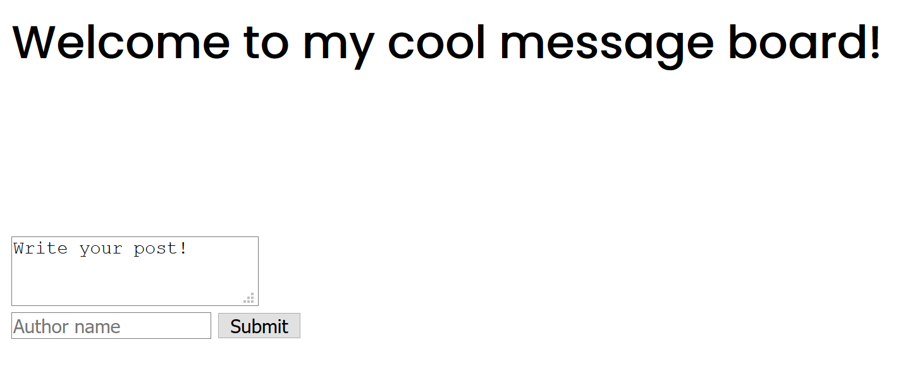
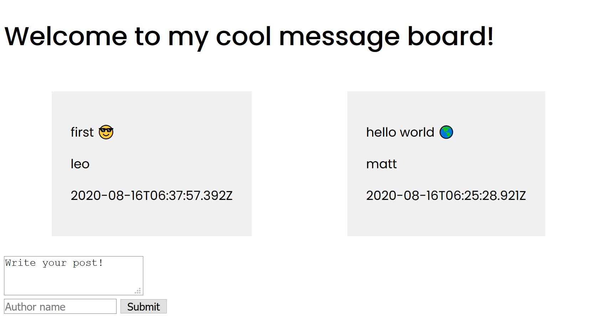

# Intro to Backend

[Link to Video.](https://www.youtube.com/watch?v=kwy4U0980Eg)

While not relevant to your learning labs, Leo walks you through a core part of web development.

What we've been doing up until now is learning skills that build out our **frontend** toolkit. However, like an angler fish, frontend development is the beautiful light that obscures the beast that is often the backend.

Have you ever wanted to build a messaging app, or something with storage that persists beyond localstorage, or something that requires communication between clients? Then you need a backend! In this talk, we will answer the following questions:
* Why do we need a backend?
* Diversity in the backend - why is it neat to work on?
* What are some common backend frameworks and patterns?
* How can I build a backend?
* How can I make my backend work with my frontend?

By the end of this talk, you'll be able to think at a high level about the partitioning of a webapp, and write your own (admittedly basic) fullstack application.

## Table of Contents

* [Table of Contents](#table-of-contents)
* [Why bother?](#why-bother)
* [Why is it cool?](#why-is-it-cool)
    * [The language we want to work in](#the-language-we-want-to-work-in)
    * [The framework, libraries we want to use](#the-framework-libraries-we-want-to-use)
    * [Implementation details, optimization](#implementation-details-optimization)
* [Backend Vocabulary](#backend-vocabulary)
    * [Requests, responses](#requests-responses)
    * [HTTP Methods](#http-methods)
    * [Endpoints](#endpoints)
    * [RESTful](#restful)
    * [GraphQL](#graphql)
* [Common Backend Frameworks](#common-backend-frameworks)
* [Building a Basic Backend](#building-a-basic-backend)
    * [Prototyping](#prototyping)
    * [Setting up the server](#setting-up-the-server)
    * [Middleware](#middleware)
        * [express.json()](#expressjson)
        * [What's CORS?](#whats-cors)
    * [Running the server](#running-the-server)
    * [Adding some functionality](#adding-some-functionality)
    * [Adapting functions to handlers](#adapting-functions-to-handlers)
        * [GET](#get)
        * [POST](#post)
* [Calling the backend](#calling-the-backend)
* [Now what?](#now-what)
* [Things that you should check out](#things-that-you-should-check-out)

## Why bother?

So why do we even need a backend? There are very clearly [some APIs](https://developer.mozilla.org/en-US/docs/Web/API/Window/localStorage) that let us store information for our webapp locally, and we can make requests to other APIs with [fetch](https://developer.mozilla.org/en-US/docs/Web/API/Fetch_API/Using_Fetch) -- why bother with writing our own backend?

Let's pretend we're writing our own messaging service, or a maps service, or really anything that passes around a large amount of data and/or secure data. We want to make sure that our service is difficult to break into. This immediately explains why we might want a backend.
* Security: it would be dangerous to validate credentials on the client side. This would mean sending credentials over the internet, and leaving them unencrypted on the clientside at some point.
* Storage: it would be inefficient to store images and whathaveyou in the browser. Think about what the point of YouTube is!
* Speed & partitioning: imagine if all the suggestions for Google Maps were computed on your own computer. How slow would it be? What's more, imagine how much more code that would put in your webapp that should be focused on making the raw data presentable.

Hopefully these questions shed some light on why we might want a backend for our webapp: we have some data that we need to keep elsewhere, access elsewhere, or some functionality that isn't guaranteed by a client system. What's more, we want to partition the webapp so that the heavy lifting is kept away from the aesthetics.

## Why is it cool?

You may have noticed that one of the points in the lesson breakdown asks "why is it neat to work on?".

One of the main reasons that the person who wrote this README enjoys working on the backend is that there are a lot more ways of doing something. Of course, there are certain things that will always adhere to a particular standard, such as CORS or password hashing and encryption, but for the most part, working in the backend leaves the developer spoiled for choice. We can choose the...
* language we want to work in -- not just JavaScript
* framework, libraries we want to use -- if any at all!
* implementation details of every endpoint
* way we structure our endpoints
* way we optimize functionality for our intended client or end-user

### The language we want to work in

Your backend can be written in any language that you see fit. Now of course there are a few languages that may feel a little counterintuitive to write a backend in (I'm [looking](https://github.com/edicl/hunchentoot) [at](http://bknr.net/html/home.html) [you](https://github.com/evrim/core-server), [LISP](https://www.cliki.net/web%20framework)), but for the most part, you can use whichever language you are most comfortable with. For our lesson, though, we will be using JavaScript simply to adhere to the rest of our lesson.

### The framework, libraries we want to use

As with CSS frameworks, static site generators, and JS webapp frameworks, we can choose the libraries and framework that we wish to use for the backend. There are no wrong decisions in the general case, here. If you made a mistake, it will be in the context of your particular project.

### Implementation details, optimization

Since we are the ones working all the heavy-lifting behind the scenes, we need to make our code performant and airtight. If there are any bugs on the backend, they will propagate directly to the frontend. Likewise, if there are any slowdowns on our end, they will get shot straight out to the frontend as well over layers of network communication. It is our job as a backend developer to ensure that the code we write is effective and snappy.

## Backend Vocabulary

When talking about the backend, there's a lot of terms that you'll hear thrown around. Let's define some of the big ones.

### Requests, responses

All communication on what we know as the Internet is done over HTTP.

When a client asks for some sort of information from your server, it is done using an HTTP **request**. An HTTP request has a few key parts, but the big ones are the method, URL, headers, and body.
* Method: differentiates requesting a particular resource for reading, or requesting a particular resource for creation.
* URL: the path of the resource.
* Headers: information about the request to help make sense of the...
* Body: a collection of zero or more bytes with information about the request.

When your server writes something back to the client, it is done with an HTTP **response**. These have the structure as the request that produces them. They can indicate errors or provide information on success. This is done through use of HTTP status codes.

### HTTP Methods

We have only spoken about basic HTTP requests that `GET` information from a page so far, but consider, what if we wanted to send some information to a server? Obviously, there must be a way of doing this, since we see that responses from servers -- refer to [the previous lesson](../15-async-js/README.md) -- often have a body. Then it should follow logically that we can send information in the body of our request, too, right?

Enter HTTP methods, of which there a few that will be of significance for this README:
* `GET`: used to get information from a resource
* `POST`: used to create information at a resource
* `PUT`: used to update information at a resource
* `DELETE`: used to, well, delete information from a resource

These are the suggested use cases for these HTTP methods. Of course, you can use these methods however you want, but this is poor practice.

Information about what the request wishes to do is transmitted via its body. This is usually JSON, but you can use a handful of other formats:

```json
// POST /user
{
    "name": "Leo",
    "description": "Hi"
}
```

A body is not allowed in the request when making `GET` requests. Instead, we pass it information in the form of query parameters. If you ever are on a website whose URL is something like `https://mycoolsite.com/cars?limit=25`, it is a `GET` request where you are telling the server that you only need to see the first 25 cars on the current page.

### Endpoints

Specific combinations of a method and a URL on our server compose an endpoint, which is where requests are sent to "call a function" on our server, then receive a "return code" in the form of a response.

### RESTful

[Representation State Transfer (REST)](https://en.wikipedia.org/wiki/Representational_state_transfer) and its implementation -- RESTful -- services are a class of server that meet a handful of criteria, as defined [here](https://restfulapi.net/) and [here](https://en.wikipedia.org/wiki/Representational_state_transfer):
* **Client-server**: separate the user concerns from the data storage concerns
* **Stateless**: there should not be any context between the server and the client preserved between requests
* **Cacheable**: responses must define themselves to be cacheable or not
* **Uniform interface**:
    * Resource identifications are in requests
    * Each request should provide enough information to explain how to manipulate the piece of data
    * Each message should have enough information to explain how to process it
    * A client should be able to use its results to eventually discover all the resources it needs
* **Layered system**: a client cannot tell if it is connected directly to our server or via intermediary
* **Code on demand (optional)**: transferring executable code may be desirable

What this means is that if you provide the client a stateless web interface meeting these specifications, then regardless our implementation, the client will know how to work with our data based on server responses.

### GraphQL

If you have to get and retrieve data, and not a whole lot else, consider structuring your backend in accordance with [GraphQL](https://graphql.org/). For a teaser of what things look like on a GraphQL backend:

```json
// request
// POST /pokemon
{
    pokemon(name: "Ditto") {
        id
        name
    }
}

// response
{
    "data": {
        "pokemon": {
            "name": "Ditto",
            "id": 132
        }
    }
}
```

Requests are structured in the form of queries modeled after the objects they expect in response. While we won't focus much on this API structure, it is worth investigating!

## Common Backend Frameworks

Since we're going to be working with JavaScript, we will use one of the more popular backend frameworks out there: **express**.

However, if you want to experiment with writing a backend in another language, it is just as easy! Here are a few examples of servers and libraries based on language:
* JavaScript: [express](https://expressjs.com/)
* C++: [beast](https://github.com/boostorg/beast), [restinio](https://github.com/Stiffstream/restinio), [proxygen](https://github.com/facebook/proxygen)
* Go: [echo](https://echo.labstack.com/), [gin](https://github.com/gin-gonic/gin)

This said, you actually don't need to use a framework if you don't want to. If you want to remain sane, you really just need a web server and a couple of handlers. It is possible to write a backend completely free of dependencies, just bear in mind that things will get complicated fast.

## Building a Basic Backend

Enough talk! Let's write a basic backend to do something useful for our application. I want to write a **basic** message board, where people can create messages and read messages from other people.

### Prototyping

Before we even start writing code, first we should consider what our API should look like.
* Read some amount of messages from the board --> `GET /message?amt=[number]`
* Create a message on our board --> `POST /message`

### Setting up the server

Now we need to set up the server. This is easy with express:

```js
const express = require('express');
const cors = require('cors');

const app = express();
const port = 8080;

app.use(express.json());
app.use(cors());

app.listen(port, () => {
    console.log(`Started listening at http://localhost:${port}`);
});
```

Let's break down what's going on here:
* We include `express` and `cors` from Node.
* We create an app with the `express()` function.
* We tell the app to use `express.json()` and `cors()`. We'll talk about what it means to "use" in a moment.
* We tell the app to listen for new connections on our provided port and run the provided arrow function.

#### Middleware

When we "use" a function, what we're really doing is instructing our web server to pass all requests through the specified function before sending it to its endpoint handler. So when we say `app.use(express.json())`, we're really saying that we'd like the server to send all requests through `express.json()` before sending them to our handler as usual.

##### `express.json()`

This middleware simply takes the request body and turns it into a JSON object to make life easier.

##### What's CORS?

Great question! CORS stands for **Cross Origin Resource Sharing**. The origin is the system sending the request, so cross origin means that you are trying to get some resource from another origin -- another system! This is standard practice on backends. We'll breeze over it for now, but just know that it controls who or what websites can access your backend and who cannot. It can be duped, though, so bear that in mind if you think that you can hide secure resources behind a simple layer of CORS middleware!

#### Running the server

If we try running this, then navigating to our printed URL, we will find that nothing happens. This is because we need to add a **handler** to our app:

```js
app.get('/', (req, res) => {
    res.send('hi!');
});
```

This allows us to create an endpoint at the path `/` on our server, whose function takes a request `req` and a response `res`. It then sends a simple message "hi!" as its response.

Running this, then visiting `localhost:8080`. You'll see that our response is as expected.

### Adding some functionality

Now we need to write some functions to deal with the behavior that we want. We want to save this information somewhere, so let's say that we save it to a file! Thanks to Node, these native I/O operations are possible. In reality, though, instead of a file we would just be writing to a database.

```js
const fs = require('fs');   // filesystem operations

function readPosts(count) {
    fs.readFile(DB, (err, data) => {
        if (err)
            return { err };
        else
            return { data: JSON.parse(data).slice(0, count) };
    });
}

function addPost(message) {
    fs.readFile(DB, (err, data) => {
        if (err)
            return err;

        let postArr = Array.from(JSON.parse(data));
        j.push(message);
        fs.writeFile(DB, JSON.stringify(j), (err, data) => {
            if (err)
                return err;
        });
    });
}
```

Long story short, we wrote a read function to read some count of posts from the file. We also wrote an add function to read the entire file into memory as an array of objects, add on our new object, then write it back.

Now, we need to adapt these functions to the web, such that they handle their input and output in terms of requests and responses. That is, we need to use this code in an **HTTP handler**.

#### Adapting functions to handlers

Now there's two ways that we can move forward from here:
1. The right way, in which we write request handlers that call these functions and work with our internal API.
2. The quick and dirty way, in which we write request handlers that directly implement their own functionality with our library API.

Let's weigh the pros and cons:

| | Right | Dirty |
|-|-|-|
| Writing it the first time | Laborioius | Easy |
| Modifying an interface down the line | Easy | Laborious |

What a perfect predicament.

For our purposes, we will roll with the quick and dirty method since we'd like to accomplish this within an hour, but in a real world project, you will almost always want to write things the **right way**.

With that said, let's adapt our functions into handlers. First, we have to provide `express` a path and method to associate each handler to:

```js
app.get('/post', ...);

app.post('/post', ...);
```

Now that we're looking at this, maybe it isn't such a good idea to call our user's writings *posts*:

```js
app.get('/message', ...);

app.post('/message', ...);
```

Now we can go ahead and create our handler functions. There are two parameters to an `express` handler function: the request and the response.

```js
app.get('/message', (req, res) => {
    // ...
});

app.post('/message', (req, res) => {
    // ...
});
```

From here, we can write our functions.

##### GET

To get a message, we expect some count of our messages to be provided in the URL. Remember - we can't use the body if we are using the `GET` method. We can retrieve these variables as a map via the `req.body` variable. We can also go ahead and write our responses with `express`' function `res.json()`.

```js
app.get('/message', (req, res) => {
    fs.readFile(DB, (err, data) => {
        if (err || !req.query.count)
            res.status(500).json(err).end();
        else
            res.status(200).json(JSON.parse(data).slice(0, req.query.count)).end();
    });
});
```

Notice that we added in some extra error handling too. With that, we are good to go.

##### POST

To create a message, we expect the basic properties of a message. Let's say we want a body and an author, at the very least. Thanks to our use of `express.json()` middleware, this makes implementing this functionality a breeze.

```js
app.post('/message', (req, res) => {
    fs.readFile(DB, (err, data) => {
        if (err)
            res.status(500).json(err).end();
        let j = Array.from(JSON.parse(data));
        j.push(req.body);
        fs.writeFile(DB, JSON.stringify(j), (err, data) => {
            if (err)
                res.status(500).json(err).end();
        });
    });
    res.status(200).end();
});
```

### Calling the backend

Now that that's out of the way, we can focus on our client, which will be **beautiful**:



Alright I was exaggerating.

In any case, we want to get our information from the backend. We can do this with a `fetch` call!

```js
fetch(`http://localhost:8080/message?count=${n}`)
.then(r => {
    return r.json();
})
.then(j => {
    console.log(j);
});
```

Notice anything missing from here? You should: the `catch` block.

In any case, this `fetch` call allows us to get data from the backend, and then propagate the JSON body forward to the frontend! The code used in the [example site](./myMsgBoard) is completely static, but you can get by making the same call in your React webapp.

Let's also examine how we might make a call to our `POST` endpoint:

```js
fetch('http://localhost:8080/message', {
    method: 'post',
    headers: {
        'Content-Type': 'application/json',
    },
    body: JSON.stringify({
        text: 'hey there',
        author: 'Leo',
        date: new Date(),
    }),
});
```

Here you can see all the properties:
* The method is `POST`
* The resource we are talking about is `/message`
* Our `Content-Type` headers indicate to the server that it is to expect a JSON body
* The body has all required fields for the message creation

If we make this request then promise chain off of it to report back the response code, we will see a response code of `201: Status Created`.

The responses can then be used as we please. For the `GET` response, we get an array of messages back, so we may wish to parse the list and then create some elements on the webpage for the posts. For the `POST` response, if we were a React webapp we may wish to update our internal state to reflect the new message. But today, we are backend developers, and backend developers don't have to worry about those details.



Now our message board has been brought to life! Now to figure out the styling situation a little bit...

# Now what?

From here, you can play around with adding extra endpoints to your basic message board backend. How can we delete a message? How can we modify one?

You can (and should) also add validation of types passed to each endpoint.

You can also add fields to the data types and realize why building a backend quick and dirty is not the wisest decision in something like JavaScript.

Something that should be **immediately addressed** though is the storage method. Using a simple JSON file that is read into memory will inflate cost exponentially. Instead, think of better ways of approaching the problem through use of some of the functions in the `fs` interface. Better yet, try switching over to a proper database.

## Things that you should check out

Obviously I'm not going to be able to talk about everything in an hour, nor is this tutorial going to be of a great deal of use without supplementary resources. Here are some terms that you should **really know** and think about when writing a backend in the real world:
* Databases, relational versus non-relational (document-based): do I need an Excel sheet or an Object database?
* Atomicity: what happens when multiple people operate on the same resource at the same time?
* Hashing, salting; password security: how do we keep our passwords secure, even if someone gets their hands on them?
* Packet loss, recovery: what happens when we lose packets on a stateful backend? What if the backend goes down altogether? How do we recover?

Here are some resources to help demystify those terms I just threw out:
* [The Java tutorial's definition of atomicity](https://docs.oracle.com/javase/tutorial/essential/concurrency/atomic.html)
* [MongoDB](https://www.mongodb.com/), a non-relational, document-based database
* [PostgreSQL](https://www.postgresql.org/), a relational, industry-standard database
    * This said, it is falling off in popularity these days.
* [Auth0 blog post on how passwords should be stored](https://auth0.com/blog/hashing-passwords-one-way-road-to-security/)
