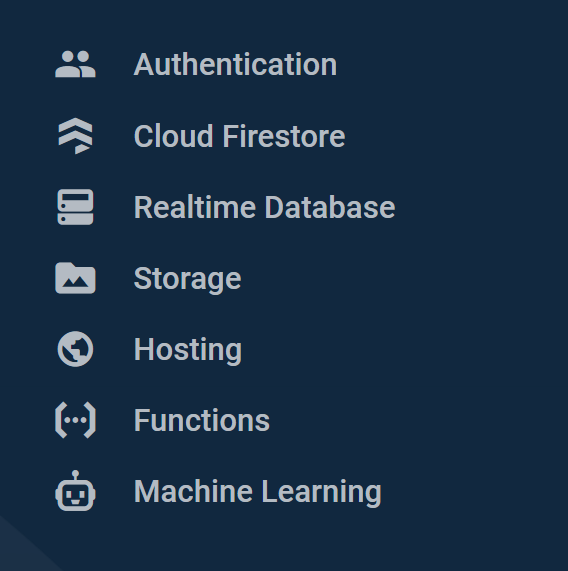
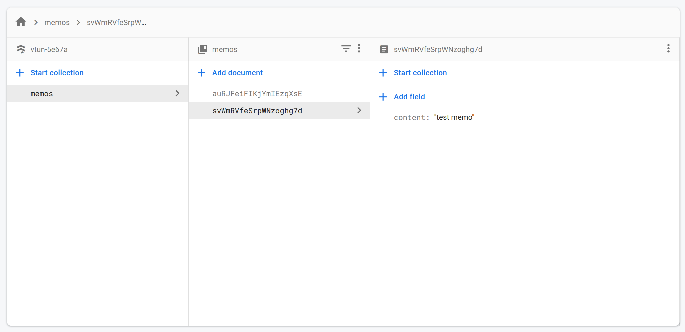

# Intro to Firebase

[Link to Video](https://www.youtube.com/watch?v=K5OQD7DdDoo).

While unnecessary to development of your learning labs, we will walk through one of the more popular key-value databases (more like a pseudo-backend) out there right now: Firebase. What you'll learn today in this completely optional lesson:
* What is firebase? How is it different from other databases?
* How can I interact with firebase from my webapp or backend?

## Relational v. Non-relational

A traditional relational database is something like an Excel file, with sheets of rows and columns of data. This is the structure of databases based on SQL (Structured Query Language). So for my user, Matt, the entry would look like:

| Name | Email | Password
|-|-|-|
| Matt | hi@matt.wang | secret |

Unlike relational databases, non-relational databases (like Firestore or MongoDB) focus on storing data in the form of documents. Rather than keeping all data on a user in a row of your `users` table, you instead keep all their data within a **document** in your `users` **collection**. A document is essentially just a JavaScript `Object`! It's this closely-tied semantic structure that lends non-relational databases so well to modern app development. My Matt user would instead look like this:

```json
// users/matt
{
    "name": "Matt",
    "email": "hi@matt.wang",
    "password": "secret"
}
```

That is, we have created a **document** of ID **Matt** inside the **users collection**, containing the **fields** "name", "email", and "password", each with their own values.

Of course typically we wouldn't want to be storing passwords in our database in plaintext, but this is an example!

With the basics out of the way, let's dive into Firebase.

## Firebase features

The reason that I introduced Firebase as a "pseudo-backend" is that it doesn't just offer a document-based database. It offers:
* Real-time database
* Easy email, password authentication and storage
* File hosting
* Security
* Scalability
* Remote configuration
* Cloud functions

Truly, firebase isn't just a database, but rather a hollistic solution to application development.

## Working with Firebase

One of the best parts of working with Firebase is the fact that it is so easy to write code for. As a Google product, it has bindings in almost every language that you can think of for web service development. For our purposes, we will use JavaScript again.

First, we need to log in to our [Firebase console](https://console.firebase.google.com). This is where we will get our database set up. After logging in (or creating an account), we should be presented with a screen to create a new app.

Clicking on "create a new app", we can then customize the app name and its ID. We also have the option of Google Analytics (up to you). Once these two options are selected, Google will allocate resources to your project and redirect you to the homepage, where you can pick from any of the numerous features of Firebase to add to your app:



Let's add a database with **Cloud firestore**. If we click "create a database", we will be presented two setup options - production mode or test mode. For our intro, we will just start in test mode, which allows all reads and writes to the database. **This is not safe, and should be disabled later on for professional apps**. We can also choose the server location.

From here, we should be presented with an interface to "start a collection". We don't have to worry about this for now, since we are just going to experiment with our database, and any document create records that we send will automatically create the requisite collections.

From here, we can hook it up to our application.

## Connecting to our app

To connect our Node application to our firestore database, we just need to download the bindings and [follow along with their firebase admin guide](https://firebase.google.com/docs/admin/setup). We'll do so together, writing a simple program that will apply native file system operations, reads and writes to our database.

Before we start, we need to acquire some credentials from the database. Simply go to your project settings > service accounts > create service account.

We can then practically copy and paste the setup code they give us:

```js
// index.js
var admin = require("firebase-admin");

var serviceAccount = require("path/to/serviceAccountKey.json");

admin.initializeApp({
  credential: admin.credential.cert(serviceAccount),
  databaseURL: // ...
});
const db = admin.firestore();
```

This initializes our app by opening a connection to our Firebase application as an admin, then opening a connection to the database via call of `firestore()`. Next, for our main routine.

## Working with Firebase bindings

To reiterate, one of the best parts of Firebase is the fact that it has intuitive bindings in so many languages. For the JavaScript admin library, to select a collection, we just make a call to `db.collection()`. To select a document from that collection, we make a call to `db.collection().doc()`.

Then, to work with that reference, we can:
* `get()`, to retrieve a copy of its data at this moment in time
* `set()`, to set its data to a particular value
* `update()`, to set selectively merge fields
* `create()`, to create a document that doesn't yet exist
* `delete()`, to remove a document

Sometimes, we also want to create a new document with some random UID. Firebase accounts for this in JavaScript by allowing us to just call `doc()` with no arguments to generate a new document with a random UID.

## Putting it together

For our main routine, let's write a simple program that might have some real use: a command line utility that reads from standard input and echoes to a new document.

To read from standard input, all we need to do is make a call to `fs.readFileSync`. Then, we can split the input string into some key-value pairs and create a new document.

```js
// index.js

// from last time: the library used for native
// filesystem operations.
const fs = require('fs');

// read from stdin
const input = fs.readFileSync(0).toString();

// write to our database, promise chaining to catch
// errors
db.collection('memos').doc().set({
    content: input,
})
.then(r => {
  console.log(`Write completed at: ${new Date()}`);
})
.catch(err => {
  console.error(`Failed to write! ${err}`);
});
```

Now if we run this like so:

```sh
echo -n 'test memo' | node index.js
```

It will be sent to our database and saved as a document! If data already exists at that location, then we print it out before overwriting. If something unexpected occurs, then we will have an error spat back out at us. We can monitor this live on our database if we keep our Firebase console open in the other window:



With that, our super-simple console program is written!

For a more challenging example, try putting this example of writing to Firestore together with our backend example from two weeks back, and you'll be able to create a functioning backend with a database!

## Resources
* [The Google Cloud Firestore quickstart guide](https://firebase.google.com/docs/firestore/quickstart)
* [Node filesystem library docs](https://nodejs.org/api/fs.html)
* [About PostgreSQL](https://www.postgresql.org/about/), a widely-used relational database.
* [MongoDB v. MySQL from MongoDB](https://www.mongodb.com/compare/mongodb-mysql). Bear in mind the bias here.
